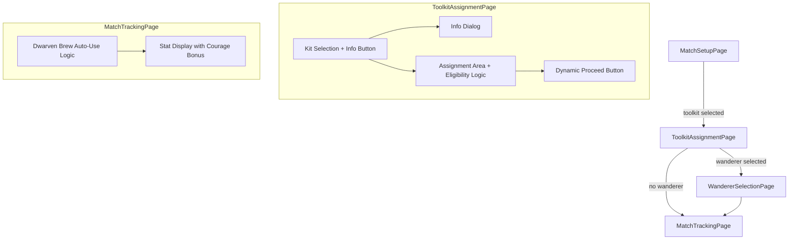
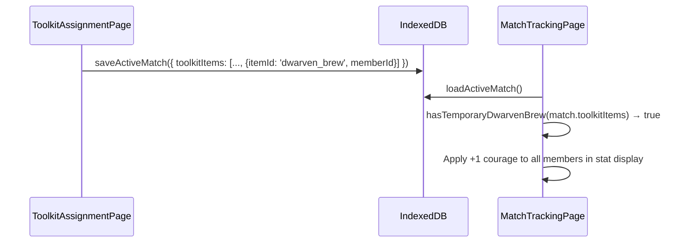

# Design Document: ATO Kit Enhancements

## Overview

This feature enhances the Against the Odds (ATO) Toolkit bonus flow with five improvements:

1. **Kit Info Dialog** — An information popup on the Toolkit Assignment Page showing item names, descriptions, and quantities before kit selection.
2. **Dwarven Brew Auto-Use** — Automatic +1 Courage bonus application at match start when Dwarven Brew is assigned as a temporary kit item (skipping the intelligence test since the item is discarded post-match anyway).
3. **Permanent Dwarven Brew Manual Use** — A prompt at match start allowing the player to elect to use their permanent Dwarven Brew, with intelligence test and potential item removal on failure.
4. **Duplicate Item Assignment Prevention** — Logic preventing a member from receiving more than one copy of the same kit item, or a kit item they already permanently own.
5. **Dynamic Proceed Button Label** — The proceed button text changes based on whether the Wanderer Selection Page follows toolkit assignment.

All changes are confined to `ToolkitAssignmentPage.tsx` and `MatchTrackingPage.tsx`, with a new pure utility function for the courage bonus calculation.

## Architecture



The architecture remains a linear page flow. No new pages or routes are introduced. The changes are:

- **ToolkitAssignmentPage**: Add info button + dialog, eligibility filtering in assignment dropdowns, dynamic button label.
- **MatchTrackingPage**: Add courage bonus calculation when temporary `dwarven_brew` is present in `toolkitItems`. Add permanent Dwarven Brew use prompt with intelligence test flow.
- **New utility**: `src/utils/kitEligibility.ts` — pure functions for duplicate/ownership eligibility checks.
- **New utility**: `src/utils/dwarvenBrew.ts` — pure functions for courage bonus calculation and intelligence test outcome.

## Components and Interfaces

### Kit Info Dialog

A new `Dialog` component rendered within `ToolkitAssignmentPage`:

```typescript
interface KitInfoDialogProps {
  open: boolean
  onClose: () => void
  kit: { id: string; label: string; items: string[] }
}
```

- Derives unique items from `kit.items` with counts via `Map<string, number>`.
- Looks up each item in `equipment.json` for `description` and `grantsSpecialRules`.
- Falls back to displaying special rules (formatted) or "No description available" indicator.

### Kit Eligibility Utility

New file `src/utils/kitEligibility.ts`:

```typescript
/**
 * Determines if a member is eligible to receive a specific kit item assignment.
 * Returns null if eligible, or a reason string if ineligible.
 */
export function getItemIneligibilityReason(
  memberId: string,
  itemId: string,
  currentAssignments: Array<{ memberId: string; itemId: string }>,
  memberOwnedEquipment: string[]
): string | null

/**
 * Returns true if assigning itemId to memberId would create a duplicate
 * (same item already assigned to same member in currentAssignments).
 */
export function hasDuplicateAssignment(
  memberId: string,
  itemId: string,
  currentAssignments: Array<{ memberId: string; itemId: string }>
): boolean

/**
 * Returns true if the member permanently owns the given item.
 */
export function hasPermamentOwnership(
  itemId: string,
  memberOwnedEquipment: string[]
): boolean
```

### Dwarven Brew Courage Bonus

New utility file `src/utils/dwarvenBrew.ts`:

```typescript
/**
 * Determines if a temporary dwarven_brew is present in toolkit items.
 * Returns true if any toolkit item has itemId === 'dwarven_brew'.
 */
export function hasTemporaryDwarvenBrew(toolkitItems: ToolkitItem[]): boolean

/**
 * Calculates the courage bonus from dwarven brew (temporary or permanent used).
 * Returns 1 if either temporary dwarven_brew is present OR permanent brew has been elected for use, 0 otherwise.
 */
export function getDwarvenBrewCourageBonus(
  toolkitItems: ToolkitItem[],
  permanentBrewUsed: boolean
): number

/**
 * Determines if a member permanently owns dwarven_brew.
 */
export function memberOwnsDwarvenBrew(member: Member): boolean

/**
 * Determines the outcome of an intelligence test for dwarven brew.
 * @param rollResult - D6 roll result (1-6)
 * @param intelligenceStat - The model's Intelligence stat value (target number, e.g. 4+)
 * @returns true if test passes (roll >= intelligenceStat), false if fails (keg runs dry)
 */
export function dwarvenBrewIntelligenceTestPasses(
  rollResult: number,
  intelligenceStat: number
): boolean
```

In `MatchTrackingPage`, the courage stat calculation adds +1 when either:
- Temporary `dwarven_brew` is present in `toolkitItems` (auto-used), OR
- Permanent `dwarven_brew` owner has elected to use it (tracked via match state)

### Permanent Dwarven Brew Use Flow

State tracked in `MatchTrackingPage`:

```typescript
interface DwarvenBrewState {
  /** Whether a permanent brew prompt has been shown/resolved */
  promptResolved: boolean
  /** Whether the player elected to use their permanent brew */
  elected: boolean
  /** Intelligence test result (null if not yet rolled) */
  intelligenceTestResult: number | null
  /** Whether the test passed (brew retained) or failed (brew removed post-match) */
  testPassed: boolean | null
  /** Member ID of the brew owner */
  ownerMemberId: string | null
}
```

Flow:
1. On match start, check if any member has `dwarven_brew` in `ownedEquipment`
2. If yes, show prompt: "Use Dwarven Brew? (+1 Courage to all, Intelligence Test required)"
3. If player elects YES:
   - Apply +1 Courage to all members
   - Show intelligence test dialog (roll D6 vs owner's Intelligence stat)
   - If roll < Intelligence value → mark brew for removal at end of match
   - If roll >= Intelligence value → brew retained
4. If player declines → no bonus, no test, brew retained

### Dynamic Proceed Button

The proceed button in `ToolkitAssignmentPage` reads the active match's `atoBonuses` array:

```typescript
const buttonLabel = match?.atoBonuses.includes('wanderer')
  ? 'Next: Choose Wanderer →'
  : 'Begin Battle'
```

This requires loading the active match state on mount (already done implicitly via `loadActiveMatch`).

## Data Models

No new persistent data models are introduced. All changes operate on existing types:

- **`ActiveMatchState.toolkitItems: ToolkitItem[]`** — already exists, used to detect temporary dwarven_brew.
- **`Member.ownedEquipment?: string[]`** — already exists, used for permanent ownership checks.
- **`equipment.json`** — already contains `description` and `grantsSpecialRules` fields used by the info dialog.

### Data Flow for Courage Bonus



## Correctness Properties

*A property is a characteristic or behavior that should hold true across all valid executions of a system — essentially, a formal statement about what the system should do. Properties serve as the bridge between human-readable specifications and machine-verifiable correctness guarantees.*

### Property 1: Kit info deduplication preserves total count

*For any* kit item list, the sum of displayed quantities in the info dialog should equal the total number of items in the kit's `items` array, and each unique item should appear exactly once.

**Validates: Requirements 1.3**

### Property 2: Item description fallback completeness

*For any* equipment or wargear item without a `description` field in the data source, the info dialog display should contain either the item's formatted `grantsSpecialRules` or a fallback indicator string — never an empty/blank entry.

**Validates: Requirements 1.4**

### Property 3: Temporary dwarven_brew applies +1 courage to all members

*For any* set of company members and any `toolkitItems` array containing at least one item with `itemId === 'dwarven_brew'`, the effective courage value for every member should equal their base courage + stat increases − stat decreases + 1.

**Validates: Requirements 2.1, 2.2**

### Property 4: Permanent dwarven_brew does not auto-apply courage bonus

*For any* member with `dwarven_brew` in `ownedEquipment` but no temporary `dwarven_brew` in `toolkitItems`, the effective courage value should equal base courage + stat increases − stat decreases (no +1 bonus).

**Validates: Requirements 2.4**

### Property 5: No duplicate kit item assigned to same member

*For any* valid assignment state produced by the eligibility logic, no member should have more than one instance of the same `itemId` assigned to them in the `assignments` array.

**Validates: Requirements 3.1**

### Property 6: No kit item assigned to member with permanent ownership

*For any* member whose `ownedEquipment` contains item X, the eligibility function should return an ineligibility reason (non-null) when attempting to assign kit item X to that member.

**Validates: Requirements 3.2**

### Property 7: Proceed button label determined by wanderer bonus presence

*For any* `atoBonuses` array, if it includes `'wanderer'` then the proceed button label should be `"Next: Choose Wanderer →"`, otherwise it should be `"Begin Battle"`.

**Validates: Requirements 4.1, 4.2**

### Property 8: Permanent dwarven_brew intelligence test determines retention

*For any* intelligence test roll result and intelligence stat value, the brew is retained if and only if roll >= intelligence stat value. If the test fails (roll < intelligence stat), the brew is marked for removal from the owner's equipment at end of match.

**Validates: Requirements 5.4, 5.5, 5.6**

### Property 9: Permanent dwarven_brew elected use applies same courage bonus as temporary

*For any* set of company members where the player has elected to use a permanent dwarven_brew, the effective courage value for every member should equal their base courage + stat increases − stat decreases + 1 (identical to temporary brew bonus).

**Validates: Requirements 5.2, 5.3**

### Property 10: Declining permanent dwarven_brew use applies no bonus and retains item

*For any* member owning permanent dwarven_brew where the player declines to use it, the effective courage value should have no +1 bonus, and the item should remain in the member's equipment.

**Validates: Requirements 5.7**

## Error Handling

| Scenario | Handling |
|----------|----------|
| Equipment item not found in `equipment.json` or `wargear.json` | Display humanised ID as label, show fallback indicator for description |
| Active match not found when ToolkitAssignmentPage loads | Redirect to match setup (existing behaviour) |
| Kit with zero items (defensive) | Render empty info dialog body with "No items" message |
| Member has no `ownedEquipment` field (undefined) | Treat as empty array — no ownership conflicts |
| All members ineligible for a kit item | All dropdown options disabled; user can still proceed with partial assignment (existing confirm dialog) |
| Permanent brew owner has no Intelligence stat | Default to Intelligence 4+ (standard fallback) |
| Multiple members own permanent dwarven_brew | Show prompt for each owner; courage bonus stacks only once (+1 total, not per brew) |

## Testing Strategy

### Property-Based Tests (fast-check)

Each correctness property will be implemented as a property-based test using `fast-check` (already available in the project). Minimum 100 iterations per test.

| Property | Test File | Generator Strategy |
|----------|-----------|-------------------|
| 1 (deduplication) | `src/utils/__tests__/kitInfoDeduplication.property.test.ts` | Generate random arrays of item IDs with duplicates |
| 2 (fallback) | `src/utils/__tests__/kitInfoFallback.property.test.ts` | Generate item objects with/without description and grantsSpecialRules |
| 3 (courage bonus) | `src/utils/__tests__/dwarvenBrewCourage.property.test.ts` | Generate random member stats + toolkitItems with/without dwarven_brew |
| 4 (no auto-apply) | `src/utils/__tests__/dwarvenBrewCourage.property.test.ts` | Same file, separate property — generate members with permanent dwarven_brew only |
| 5 (no duplicate) | `src/utils/__tests__/kitEligibility.property.test.ts` | Generate random kit item lists + assignment sequences |
| 6 (ownership) | `src/utils/__tests__/kitEligibility.property.test.ts` | Generate members with random ownedEquipment overlapping kit items |
| 7 (button label) | `src/utils/__tests__/proceedButtonLabel.property.test.ts` | Generate random AtoBonusType arrays |
| 8 (intelligence test) | `src/utils/__tests__/dwarvenBrewCourage.property.test.ts` | Generate random roll results (1-6) and intelligence stat values (1-6) |
| 9 (permanent elected) | `src/utils/__tests__/dwarvenBrewCourage.property.test.ts` | Generate random member stats with permanent brew elected |
| 10 (permanent declined) | `src/utils/__tests__/dwarvenBrewCourage.property.test.ts` | Generate random member stats with permanent brew declined |

### Unit Tests (example-based)

- Info dialog opens/closes correctly (Requirements 1.1, 1.2, 1.5)
- Dwarven Brew intelligence test skipped for temporary items (Requirement 2.3)
- Permanent Dwarven Brew prompt shown at match start when member owns brew (Requirement 5.1)
- Intelligence test dialog: pass retains brew, fail marks for removal (Requirements 5.5, 5.6)
- Declining permanent brew use: no bonus applied, item retained (Requirement 5.7)
- Reassignment after clearing works (Requirement 3.4)
- Button label updates reactively (Requirement 4.3)

### Integration Tests

- Full flow: select kit → assign items → proceed to wanderer or match
- Dwarven Brew courage bonus visible in MatchTrackingPage stat block (temporary)
- Permanent Dwarven Brew: elect use → intelligence test → courage bonus applied → brew removed on fail
- Permanent Dwarven Brew: decline use → no bonus → brew retained
- Envenom weapon eligibility still works alongside new duplicate prevention

### Test Configuration

- Property tests: `fast-check` with `{ numRuns: 100 }` minimum
- Tag format: `Feature: ato-kit-enhancements, Property {N}: {title}`
- Test runner: Vitest (existing project setup)
