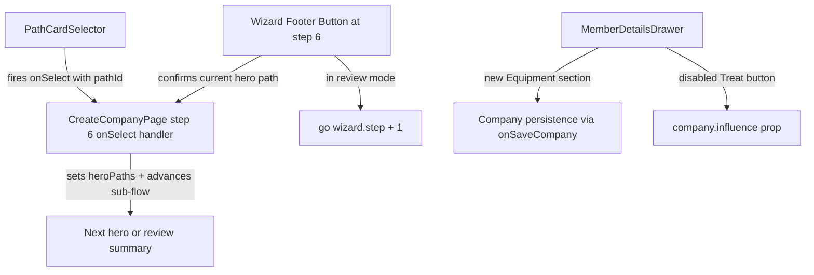

# Design Document

## Overview

Three targeted UX improvements to existing components in the Battle Companies companion app:

1. **Path Selection Flow (PathCardSelector + CreateCompanyPage step 6)** — The path card's Select button already fires `onSelect` unconditionally (correct). The bug is in `CreateCompanyPage`'s step 6 footer button: it currently calls `go(wizard.step + 1)` which advances the entire wizard instead of advancing within the path sub-flow. The fix involves two locations: (a) the `onSelect` handler in step 6 must set the path AND advance to the next hero, and (b) the wizard footer button at step 6 must confirm the current hero's path and advance within the sub-flow (not advance the wizard). Footer button is disabled when current hero has no path, shows "Select" while picking paths, and shows "Next" only in review mode.

2. **MemberDetailsDrawer — Equipment section** — Extract non-combat equipment (`member.ownedEquipment` minus `envenom_weapon`) into a dedicated "Equipment" section positioned between Wargear and Experience. Includes edit/remove flow for hero roles.

3. **MemberDetailsDrawer — Treat button disabled state** — When company IP < 1, show the Treat button in a disabled visual state with "No IP Available" error text instead of hiding it entirely, so players understand the constraint.

## Architecture

No new services, routes, or data stores. All changes are localised to two existing React components:



**Key architectural decisions:**

- Equipment section reuses the existing `onSaveCompany` prop for persistence (same pattern as wargear edit mode).
- Treat button disabled state is derived directly from `company.influence` prop — no new state management needed.
- PathCardSelector already calls `onSelect(path.id)` unconditionally — no changes needed to PathCardSelector itself.
- The fix is split across two locations in `CreateCompanyPage`:
  1. The `onSelect` callback passed to `StepPathSelection` at step 6 — must set the path AND advance to next hero (currently only sets the path).
  2. The wizard footer button at step 6 — must NOT call `go(wizard.step + 1)`. Instead it confirms the current hero's selected path and advances within the sub-flow (same effect as clicking the card's Select button on an already-selected path).
- Footer button disabled state at step 6 is derived from whether the current pending hero has a path selected (not from `canAdvance()` which checks ALL heroes).

## Components and Interfaces

### PathCardSelector — No Changes Required

Current behaviour (from code review): The Select button already calls `onSelect(path.id)` regardless of selection state. The button is never disabled. The variant toggles between `outlined` (selected) and `contained` (unselected). Label toggles between "Path Chosen ✓" (selected) and "Select This Path" (unselected).

**Required changes:** None. PathCardSelector already satisfies acceptance criteria 1.8 and 1.9. The component is a pure presentation/interaction layer — it fires `onSelect` and the parent decides what to do.

### CreateCompanyPage Step 6 — Footer Button + onSelect Handler

This is where the actual fix lives. Two changes needed:

#### 1. `onSelect` handler in step 6 (passed to StepPathSelection)

**Current behaviour (buggy):** The `onSelect` callback only sets the path in wizard state:
```typescript
onSelect={(pathId) =>
  setWizard((w) => ({
    ...w,
    heroPaths: { ...w.heroPaths, [pendingHeroTempId]: pathId },
  }))
}
```
This stores the path but does NOT advance to the next hero. The user must then click the footer button (which wrongly advances the entire wizard).

**New behaviour:** The `onSelect` callback sets the path AND advances the sub-flow to the next hero. Since React state updates are batched, setting `heroPaths[currentHero] = pathId` causes `pendingHeroTempId` to recompute on next render — automatically showing the next hero (or review summary if all done). No explicit "advance" call needed; the derived `pendingHeroTempId` logic already handles this.

```typescript
onSelect={(pathId) =>
  setWizard((w) => ({
    ...w,
    heroPaths: { ...w.heroPaths, [pendingHeroTempId]: pathId },
  }))
}
```

Wait — this is the same code. The key insight: the current code already advances implicitly because `pendingHeroTempId` is derived from `wizard.heroPaths`. When a path is set for the current hero, the next render picks the next hero without a path. **The existing `onSelect` handler is already correct for advancing the sub-flow.** The bug is solely in the footer button.

#### 2. Wizard footer button at step 6

**Current behaviour (buggy):**
```typescript
// Footer button onClick at step 6:
go(wizard.step + 1)  // Advances entire wizard to step 7 (Gold)
```
This is wrong because `canAdvance()` at step 6 requires ALL heroes to have paths. So the button is disabled until all heroes are done, then it advances the wizard. But the button label says "Select" implying it should confirm the current hero.

**New behaviour:**
- **When in path-picking mode** (not all heroes have paths): Footer button confirms the current hero's path and the sub-flow advances to next hero. Effectively the same as re-clicking the card's Select button. The button is disabled if the current hero has no path selected yet.
- **When in review mode** (all heroes have paths): Footer button shows "Next" and calls `go(wizard.step + 1)` to advance the wizard.

```typescript
// Pseudocode for footer button at step 6:
const heroTempIds = [wizard.leaderId!, ...wizard.sergeantIds]
const allHeroesHavePaths = heroTempIds.every(tid => wizard.heroPaths[tid])
const pendingHero = heroTempIds.find(tid => !wizard.heroPaths[tid])
const currentHeroHasPath = pendingHero ? !!wizard.heroPaths[pendingHero] : true

// In review mode (all paths assigned):
//   label = "Next", onClick = go(wizard.step + 1), disabled = false
// In picking mode:
//   label = "Select", disabled = !currentHeroHasPath (i.e. current hero has no path)
//   onClick = no-op (path already set, sub-flow already advanced on card click)
//   BUT if user selected path via card and hasn't advanced yet... 
//   Actually: since onSelect already advances, the footer "Select" button is a 
//   redundant confirmation. It re-fires the same onSelect logic for the current hero.

// Simplified: footer button at step 6 in picking mode is effectively a no-op 
// because the card's onSelect already advances. The footer exists as a secondary 
// affordance. Its onClick should call the same onSelect(currentPath) logic.
```

**Implementation detail:** The footer button in picking mode calls the same `onSelect` handler with the currently-selected path for the pending hero. Since the path is already set in state, this is a no-op on state (path already equals pathId), but the re-render still shows the next hero because `pendingHeroTempId` recomputes. Actually — if the hero already has a path set (user clicked card), `pendingHeroTempId` already moved to the next hero. So the footer button in picking mode is only relevant when the user has selected a path (card button set it) but wants to explicitly "confirm" — which already happened automatically.

**Revised understanding:** The `onSelect` on the card already sets path + advances (via derived state). The footer button's role at step 6:
- **Disabled** when current pending hero has no path yet (nothing to confirm)
- **Enabled with label "Select"** — this state is actually transient/impossible because once a path is selected via card, the sub-flow auto-advances. The footer button serves as a secondary confirmation point for users who selected a path but the UI hasn't re-rendered yet (edge case with spell selection for Sorcerer path).
- **In review mode (label "Next")** — advances wizard to step 7

For the Sorcerer path edge case: when a hero picks Path of the Sorcerer, `pendingHeroTempId` still points to that hero (because spell isn't chosen yet). The footer "Select" button should be disabled in this state since the spell sub-step is active.

**Final footer button logic at step 6:**
```typescript
disabled={
  allHeroesHavePaths 
    ? false  // review mode: always enabled
    : !wizard.heroPaths[pendingHeroTempId]  // picking mode: disabled if no path
}
label={allHeroesHavePaths ? 'Next' : 'Select'}
onClick={() => {
  if (allHeroesHavePaths) {
    // Review mode — advance wizard
    go(wizard.step + 1)
  } else {
    // Picking mode — no-op needed; card onSelect already advanced.
    // But as a safety measure, re-set the current path to trigger re-render:
    const currentPath = wizard.heroPaths[pendingHeroTempId]
    if (currentPath) {
      setWizard(w => ({ ...w, heroPaths: { ...w.heroPaths, [pendingHeroTempId]: currentPath } }))
    }
  }
}}
```

### MemberDetailsDrawer — Equipment Section

New section rendered between Wargear and Experience:

```typescript
// New state
const [equipEditMode, setEquipEditMode] = useState(false)
const [equipRemoveConfirmItem, setEquipRemoveConfirmItem] = useState<string | null>(null)

// Derived data
const displayEquipment = (member.ownedEquipment ?? []).filter(id => id !== 'envenom_weapon')

// Wargear section exclusion — filter ownedEquipment items from allWargear
const allWargear = Array.from(new Set([...baseEquip, ...assignedEquip, ...envenomWargearEntries]))
  .filter(id => !displayEquipment.includes(id))
```

**Props:** No new props needed. Uses existing `company`, `onSaveCompany`, `member`.

### MemberDetailsDrawer — Treat Button Disabled State

```typescript
// Derived
const hasIP = (company?.influence ?? 0) >= 1

// For each injury card, determine treatability
const isTreatable = (injuryType: InjuryType, role: MemberRole): boolean => {
  if (injuryType === 'missing_next_game') return true
  if (role !== 'warrior' && ['arm_wound', 'leg_wound', 'broken_honour'].includes(injuryType)) return true
  return false
}
```

Button renders in disabled state when `!hasIP && isTreatable(injury.type, member.role)`:
- `opacity: 0.4`
- `disabled` prop or `pointerEvents: 'none'`
- Red "No IP Available" text below

## Data Models

No changes to data models. Existing types used:

- `Member.ownedEquipment?: string[]` — already exists, stores equipment IDs
- `Company.influence: number` — already exists, IP balance
- `Member.role: MemberRole` — used for edit button visibility and treat eligibility

Equipment items referenced from `equipment.json` (id-based lookup for labels).

## Correctness Properties

*A property is a characteristic or behavior that should hold true across all valid executions of a system — essentially, a formal statement about what the system should do. Properties serve as the bridge between human-readable specifications and machine-verifiable correctness guarantees.*

### Property 1: onSelect always fires with displayed path ID regardless of selection state

*For any* path card displayed in the PathCardSelector and *for any* selection state (selected or not), activating the Select button SHALL invoke the `onSelect` callback with that path's ID, and the button SHALL never be disabled.

**Validates: Requirements 1.1, 1.2, 1.8**

### Property 2: Select button label and variant match selection state

*For any* path card displayed in the PathCardSelector, the Select button SHALL display label "Path Chosen ✓" with variant `outlined` when the path is selected, and label "Select This Path" with variant `contained` when the path is not selected.

**Validates: Requirements 1.9**

### Property 3: Path sub-flow advances on selection (onSelect sets path and derived state advances)

*For any* wizard state at step 6 with N heroes requiring paths, when `onSelect(pathId)` is called for the current pending hero, the wizard state SHALL have `heroPaths[currentHero] = pathId` and the next derived `pendingHeroTempId` SHALL be the next hero without a path (or `undefined` if all heroes now have paths, triggering review mode).

**Validates: Requirements 1.1, 1.2, 1.3**

### Property 4: Wizard footer button disabled when current hero has no path

*For any* wizard state at step 6 where a hero is pending path selection and that hero does not yet have a path assigned, the wizard footer button SHALL be disabled. Conversely, when the pending hero has a path assigned OR all heroes have paths (review mode), the footer button SHALL be enabled.

**Validates: Requirements 1.4**

### Property 5: Wizard footer button label matches mode

*For any* wizard state at step 6, the footer button label SHALL be "Select" when not all heroes have paths (picking mode) and "Next" when all heroes have paths (review mode).

**Validates: Requirements 1.6, 1.7**

### Property 6: Review mode footer button advances wizard (not sub-flow)

*For any* wizard state at step 6 where all heroes have paths assigned, activating the footer button SHALL advance `wizard.step` to 7 (Gold/Equipment step).

**Validates: Requirements 1.5, 1.6**

### Property 7: Equipment/Wargear partition correctness

*For any* member with an `ownedEquipment` array, all items in `ownedEquipment` except `envenom_weapon` entries SHALL appear in the Equipment section and SHALL NOT appear in the Wargear section. Conversely, `envenom_weapon` entries SHALL appear in the Wargear section and NOT in the Equipment section.

**Validates: Requirements 2.1, 2.7**

### Property 8: Edit button visibility matches hero role

*For any* member, the Equipment section "Edit" button SHALL be visible if and only if the member's role is `leader`, `sergeant`, or `hero_in_making`.

**Validates: Requirements 2.4**

### Property 9: Remove control present for each equipment item in edit mode

*For any* member with a hero role and a non-empty `ownedEquipment` array (excluding `envenom_weapon`), while the Equipment section is in edit mode, each displayed equipment item SHALL have a remove control.

**Validates: Requirements 2.5**

### Property 10: Treat button state matches IP availability

*For any* member with treatable injuries (missing_next_game for any role; arm_wound, leg_wound, broken_honour for hero roles), the Treat button SHALL be visually disabled (opacity 0.3–0.5) with "No IP Available" error text when company IP < 1, and SHALL be in normal interactive state without error text when company IP ≥ 1.

**Validates: Requirements 3.1, 3.2, 3.4**

### Property 11: Disabled Treat button prevents treatment flow

*For any* member with treatable injuries and a company with IP < 1, activating the disabled Treat button SHALL NOT initiate the injury treatment flow (no dialog/stage transition).

**Validates: Requirements 3.3**

## Error Handling

| Scenario | Handling |
|----------|----------|
| `member.ownedEquipment` is `undefined` | Default to empty array; show "No equipment" placeholder |
| Equipment item ID not found in `equipment.json` | Display raw ID with underscores replaced by spaces (fallback label) |
| `company` prop is `undefined` in MemberDetailsDrawer | Treat button hidden entirely (existing behaviour — no IP check needed) |
| `onSaveCompany` is `undefined` | Edit button and remove controls not rendered (guard already exists for wargear) |
| Equipment removal fails (persistence error) | Let error propagate to existing error boundary; no partial state update |

## Testing Strategy

**Property-based testing** using `fast-check` (already installed) with `vitest`.

- Each property test runs minimum 100 iterations
- Tag format: `Feature: battle-companies-ux-improvements, Property N: <title>`

**Unit tests (example-based):**
- Section ordering (Equipment between Wargear and Experience) — DOM structure check
- "No equipment" placeholder when `ownedEquipment` is empty/undefined
- Done button exits edit mode
- Reactivity: IP change updates Treat button state without remount
- Review summary displays when all heroes have paths (Requirement 1.5)
- Footer button in review mode advances wizard step (Requirement 1.6)

**Integration tests:**
- Equipment removal persists to company via `onSaveCompany`
- Full treat flow blocked when IP < 1 (end-to-end click sequence)
- Path selection via card auto-advances to next hero in sub-flow
- Footer button at step 6 does NOT advance wizard.step when in picking mode

**Test library:** `vitest` + `fast-check` for property tests, `@testing-library/react` for component rendering.
