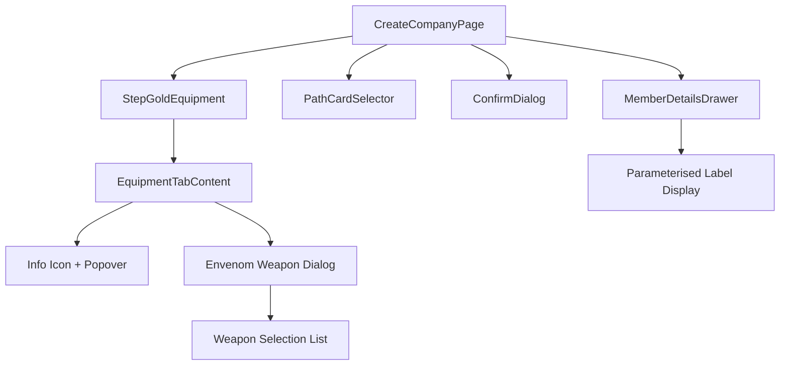

# Design Document: Company Creation Enhancements

## Overview

Four targeted improvements to the company creation wizard:

1. **Full path special rule text** — Remove 120-char truncation in `PathCardSelector` so players can read complete rule descriptions during path selection.
2. **Equipment description info icons** — Add info buttons beside equipment items in `StepGoldEquipment` that reveal full description text in a popover.
3. **Envenom Weapon parameterised purchase** — When buying Envenom Weapon with gold, prompt for weapon selection, store as parameterised entry, and display as "Envenom Weapon (WeaponName)" in `MemberDetailsDrawer`.
4. **Suppress gold confirmation dialog** — Skip the "unspent gold" `ConfirmDialog` when `goldRemaining === 0`.

All changes are UI-layer modifications to existing React components with minimal data model changes.

## Architecture



**No new components created.** All changes modify existing components:

| Component | Change |
|-----------|--------|
| `PathCardSelector` | Remove `slice(0, 120)` truncation |
| `StepGoldEquipment` (EquipmentTabContent) | Add info icon + popover; add envenom weapon selection dialog |
| `CreateCompanyPage` | Modify `handleFinish` to check `goldRemaining`; extend `goldPurchases` storage format |
| `MemberDetailsDrawer` | Format parameterised envenom entries in wargear display |

## Components and Interfaces

### 1. PathCardSelector — Full Text Display

**Current:** `rule.description.length > 120 ? rule.description.slice(0, 120) + '…' : rule.description`

**Change:** Remove truncation. Render full `rule.description` directly. No expand/collapse needed — card already scrolls vertically within the swipeable container.

### 2. StepGoldEquipment — Info Icons

**Change to `EquipmentTabContent`:**

Add `InfoOutlined` icon button next to each equipment item that has a `description` field. On press, open MUI `Popover` anchored to the icon showing full description text.

```typescript
// State added to EquipmentTabContent
const [infoAnchor, setInfoAnchor] = useState<{ el: HTMLElement; description: string } | null>(null)
```

Items without `description` field render no icon. Popover dismissed by clicking outside or pressing close.

### 3. StepGoldEquipment — Envenom Weapon Purchase

**Parameterised Purchase Flow:**

1. User clicks "Buy" on Envenom Weapon
2. Instead of immediately adding to purchases, open weapon selection dialog
3. Dialog shows member's eligible weapons (same filtering as `ToolkitAssignmentPage`)
4. User selects weapon → store as `"envenom_weapon::<weaponId>"` in `goldPurchases`
5. User cancels → no purchase made

**Storage Format Change:**

`goldPurchases: Record<string, string[]>` — entries are either plain IDs (`"backpack"`) or parameterised IDs (`"envenom_weapon::spear"`).

This encoding avoids changing the `WizardState` interface shape. The `::` delimiter is safe since no wargear/equipment ID contains `::`.

**Weapon Eligibility Filter** (reuse logic from `ToolkitAssignmentPage`):

```typescript
const NON_WEAPON_CATEGORIES = new Set([
  'armour_1', 'armour_2', 'armour_3', 'armour_4',
  'mount', 'shield', 'special',
])

function getMemberWeapons(baseUnitId: string, memberEquipment: string[]): string[] {
  const baseEquip = BASE_UNITS_MAP[baseUnitId]?.baseEquipment ?? []
  const combined = new Set([...baseEquip, ...memberEquipment])
  return [...combined].filter(id => {
    const wg = WARGEAR_MAP[id]
    return wg && !NON_WEAPON_CATEGORIES.has(wg.category ?? '')
  })
}
```

**Already-envenomed exclusion:** Parse existing `goldPurchases` for entries matching `"envenom_weapon::*"` to extract already-envenomed weapon IDs for that member.

### 4. MemberDetailsDrawer — Parameterised Display

When rendering equipment/wargear list, detect `"envenom_weapon::weaponId"` pattern and display as:

```
Envenom Weapon (Spear)
```

Using `getWargearLabel(weaponId)` for human-readable weapon name.

### 5. CreateCompanyPage — Gold Confirm Suppression

**Current `handleFinish`:**
```typescript
if ((selectedCompany?.gold ?? 0) > 0 && wizard.step === STEPS.length - 1) {
  setShowGoldConfirm(true)
}
```

**New `handleFinish`:**
```typescript
if ((selectedCompany?.gold ?? 0) > 0 && wizard.step === STEPS.length - 1 && goldRemaining() > 0) {
  setShowGoldConfirm(true)
} else {
  void doFinish()
}
```

Add `goldRemaining() > 0` condition. When all gold spent, skip dialog entirely.

### 6. CompanyFactory — Parse Parameterised Purchases

`createCompany` in `companyFactory.ts` must parse `"envenom_weapon::weaponId"` entries from `goldPurchases` and store them appropriately on the `Member` object. The envenom grants `poisoned_attacks` special rule parameterised to the weapon.

Store on member as:
- `ownedEquipment` includes `"envenom_weapon"`
- `specialRules` includes `{ id: "poisoned_attacks", parameter: "<weaponId>" }`

This matches existing pattern where parameterised special rules are stored as objects.

## Data Models

### WizardState (unchanged interface, new encoding)

```typescript
// goldPurchases values can now contain parameterised entries:
// Plain: "backpack", "healing_herbs"
// Parameterised: "envenom_weapon::spear", "envenom_weapon::bow"
goldPurchases: Record<string, string[]>
```

### Helper Functions (new)

```typescript
// Parse a goldPurchases entry
function parseGoldEntry(entry: string): { itemId: string; parameter?: string } {
  const parts = entry.split('::')
  return parts.length === 2
    ? { itemId: parts[0], parameter: parts[1] }
    : { itemId: entry }
}

// Format envenom display label
function formatEnvenomLabel(weaponId: string): string {
  return `Envenom Weapon (${getWargearLabel(weaponId)})`
}
```

### Gold Cost Calculation Update

`goldCost()` must handle parameterised entries — strip parameter before looking up cost:

```typescript
function goldCost(entry: string): number {
  const { itemId } = parseGoldEntry(entry)
  // ... existing lookup logic using itemId
}
```

## Correctness Properties

*A property is a characteristic or behavior that should hold true across all valid executions of a system — essentially, a formal statement about what the system should do. Properties serve as the bridge between human-readable specifications and machine-verifiable correctness guarantees.*

### Property 1: Path special rules completeness

*For any* path in the paths data, `getUniqueRules(path)` SHALL return exactly the progression entries where `roll ∈ {2, 3, 11, 12}` AND `label` AND `description` exist, with each description being the full untruncated text from the source data.

**Validates: Requirements 1.1, 1.3**

### Property 2: Envenom weapon options are valid weapons minus already-envenomed

*For any* member with any combination of base equipment and purchased wargear, the available envenom weapon options SHALL be a subset of the member's combined equipment filtered to weapon categories (excluding armour, mount, shield, special), minus any weapons already envenomed for that member in the current gold purchases.

**Validates: Requirements 3.2, 3.5**

### Property 3: Parameterised purchase round-trip

*For any* envenom weapon purchase with a valid weapon ID, encoding as `"envenom_weapon::<weaponId>"` and then parsing with `parseGoldEntry` SHALL recover both the item ID `"envenom_weapon"` and the original weapon ID parameter.

**Validates: Requirements 3.3**

### Property 4: Envenom display label format

*For any* weapon ID that exists in wargear data, `formatEnvenomLabel(weaponId)` SHALL produce a string matching the pattern `"Envenom Weapon (<label>)"` where `<label>` equals `getWargearLabel(weaponId)`.

**Validates: Requirements 3.4**

### Property 5: Gold confirmation dialog shown iff unspent gold exists

*For any* wizard state at the gold step where the company has starting gold > 0, the gold confirmation dialog SHALL be shown if and only if `goldRemaining > 0`. When `goldRemaining === 0`, `doFinish` SHALL be called directly.

**Validates: Requirements 4.1, 4.2**

### Property 6: Gold remaining calculation invariant

*For any* set of gold purchases across all members, `goldRemaining` SHALL equal `company.gold - Σ goldCost(entry)` for all entries across all members.

**Validates: Requirements 4.3**

### Property 7: Cross-system envenom exclusion

*For any* member who has a weapon envenomed via gold purchase (stored as `"envenom_weapon::<weaponId>"` in `goldPurchases`), that weapon SHALL also be excluded from ATO envenom options when the member's equipment list includes the envenom.

**Validates: Requirements 3.6**

## Error Handling

| Scenario | Handling |
|----------|----------|
| Envenom Weapon purchased but member has no eligible weapons | "Buy" button disabled; no dialog shown |
| All weapons already envenomed for member | Envenom Weapon item hidden from available list (same as duplicate equipment logic) |
| User cancels weapon selection dialog | No state change; purchase not recorded |
| Parameterised entry with invalid weapon ID (data corruption) | `parseGoldEntry` returns entry as-is; display falls back to raw ID |
| `goldCost` called with parameterised entry | Strip parameter before cost lookup |

## Testing Strategy

### Property-Based Tests (fast-check, min 100 iterations each)

| Property | Test File | What It Validates |
|----------|-----------|-------------------|
| 1 | `pathSpecialRulesCompleteness.property.test.ts` | Full text, correct roll filtering |
| 2 | `envenomWeaponEligibility.property.test.ts` (extend existing) | Weapon filtering + exclusion |
| 3 | `parameterisedPurchaseRoundTrip.property.test.ts` | Encode/decode preserves data |
| 4 | `envenomDisplayLabel.property.test.ts` | Label format correctness |
| 5 | `goldConfirmDialogCondition.property.test.ts` | Dialog shown iff gold > 0 |
| 6 | `goldRemainingCalculation.property.test.ts` | Arithmetic invariant |
| 7 | `crossSystemEnvenomExclusion.property.test.ts` | Gold + ATO consistency |

### Unit Tests (example-based)

- Info icon renders only for items with `description` field
- Info popover shows correct description text on click
- Envenom weapon dialog opens on purchase attempt
- Cancel dialog → no state change
- PathCardSelector renders without truncation ellipsis

### Library

- **PBT:** `fast-check` (already used in project)
- **Test runner:** `vitest` (already configured)
- Each property test tagged: `// Feature: company-creation-enhancements, Property N: <title>`
- Minimum 100 iterations per property
