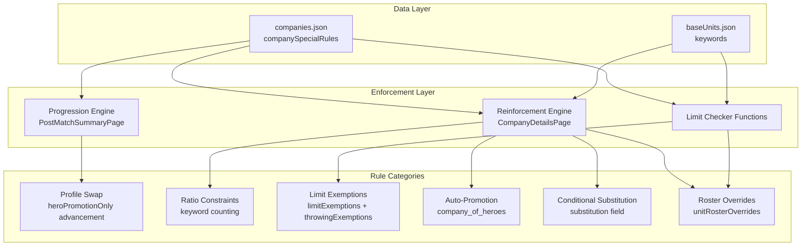

# Design Document: Company Special Rules Enforcement

## Overview

This feature adds code-level enforcement for nine company special rules across eight companies that currently exist only as descriptive text in `companies.json`. The rules span five enforcement categories:

1. **Profile Swap on Promotion** — Arnor's Ranger hero promotion
2. **Keyword-Based Ratio Constraints** — Defenders of the North (Dwarf ≤ Dale), Helm's Deep (Elf ≤ 33%)
3. **Equipment Limit Exemptions** — Sharkey's Rogues (whip/throwing), Grand Army of the South (Khandish Horsemen/bow)
4. **Auto-Promotion on Recruitment** — Wanderers in the Wild (Company of Heroes)
5. **Conditional Substitution** — The Shire (Led By the Ranger), Durin's Folk (Vault Wardens)
6. **Unit Roster/Limit Overrides** — Mirkwood (Dark Union / Warg Marauder)

All enforcement logic integrates into existing systems: the Reinforcement Engine (CompanyDetailsPage), the Progression Engine (PostMatchSummaryPage), and the Limit Checker functions (`countBowMembers`, `countCavalryMembers`, `wouldExceedThrowingLimit`).

## Architecture

The design follows the existing pattern of data-driven rule enforcement. Special rules in `companies.json` already carry structured fields (`limitExemptions`, `reinforcementSubstitution`, `unitRosterOverrides`). The implementation reads these fields at enforcement points and applies the corresponding logic.



### Design Decisions

1. **Extract limit logic into a shared utility module** (`src/utils/limitCheckers.ts`). Currently, limit functions live inline in CompanyDetailsPage. Extracting them enables unit testing and reuse. The page component calls the extracted functions.

2. **Extract hero promotion logic into `advancement.ts`**. The profile swap extends `applyHeroInTheMaking` with a new function `applyHeroPromotionSwap` that checks for `heroPromotionOnly` advancements.

3. **Keyword counting uses `baseUnits.json` lookups**. The `keywords` array on each base unit definition drives Dwarf/Dale/Elf counting. No new data structures needed.

4. **Throwing exemptions follow the existing `limitExemptions` pattern**. Add a `throwingExemptions` field (equipment-id-based) to the `whips` rule, mirroring how `limitExemptions.bow` works but filtering by equipment ID rather than baseUnitId.

5. **Roster slot overrides are applied at the counting layer**. A helper `getEffectiveRosterSlots(company, companyDef)` returns the adjusted total, used wherever `company.members.length` currently checks against `maxCompanySize`.

## Components and Interfaces

### New Utility: `src/utils/limitCheckers.ts`

Extracted from CompanyDetailsPage. Pure functions for testability.

```typescript
interface LimitCheckContext {
  members: Array<{ baseUnitId: string; equipment: string[] }>
  companyDef: CompanyDefinition
  baseUnitsMap: Record<string, BaseUnit>
  wargearCategoryMap: Record<string, string>
}

// Existing logic, extracted
function countBowMembers(ctx: LimitCheckContext, extraMembers: Array<{baseUnitId: string; equipment: string[]}>): number
function countCavalryMembers(ctx: LimitCheckContext, extraMembers: Array<{baseUnitId: string; equipment: string[]}>): number
function countThrowingMembers(ctx: LimitCheckContext, extraMembers: Array<{baseUnitId: string; equipment: string[]}>): number

// New: keyword-based counting
function countMembersByKeyword(ctx: LimitCheckContext, keyword: string): number

// New: Dwarf-Dale ratio check
function wouldExceedDwarfDaleRatio(ctx: LimitCheckContext, newMembers: Array<{baseUnitId: string}>): boolean

// New: Elf percentage check
function wouldExceedElfLimit(ctx: LimitCheckContext, newMembers: Array<{baseUnitId: string}>): boolean

// New: effective roster slot calculation
function getEffectiveRosterSlots(members: Member[], companyDef: CompanyDefinition): number

// New: throwing exemption support
function getThrowingExemptions(companyDef: CompanyDefinition): string[]
```

### Extended: `src/utils/advancement.ts`

```typescript
// New function for Arnor profile swap
function applyHeroPromotionSwap(
  member: Member,
  companyDef: CompanyDefinition
): Member | null  // returns null if no heroPromotionOnly advancement matches

// Existing function unchanged
function applyHeroInTheMaking(member: Member): Member
```

### Extended: `CompanySpecialRule` interface (models/index.ts)

```typescript
export interface CompanySpecialRule {
  // ... existing fields ...
  throwingExemptions?: string[]           // equipment IDs exempt from throwing limit
  unitRosterOverrides?: Array<{
    baseUnitId: string
    rosterSlots: number
    bowLimitCount: number
  }>
  substitution?: {
    unitId: string
    condition: { unitSlain: string }
    replacesAnyRoll?: boolean
    minRoll: number
    limit: number
    heroRoleOptions: string[]
  }
}
```

### Reinforcement Engine Extensions (CompanyDetailsPage)

New checks added to `confirmRecruitment` flow:

1. **Dwarf-Dale ratio check** — called after existing limit checks for `defenders_of_the_north`
2. **Elf percentage check** — called after existing limit checks for `helms_deep`
3. **Roster slot override** — replaces `company.members.length` with `getEffectiveRosterSlots()` for max size check
4. **Company of Heroes auto-promotion** — after `finaliseRecruitment`, if rule present, apply hero promotion + trigger path selection
5. **Led By the Ranger substitution** — shown in ReinforcementResultCard when conditions met
6. **Vault Warden overflow/replacement** — special handling in special chart result flow

### Progression Engine Extensions (PostMatchSummaryPage)

1. **Hero promotion profile swap** — when warrior rolls 6 (hero_in_making), check for `heroPromotionOnly` advancement before applying standard logic
2. **Warg Marauder injury routing** — when processing casualties, route warg_marauder to warrior injury table regardless of role

## Data Models

### companies.json Changes

**Sharkey's Rogues** — add `throwingExemptions` to `whips` rule:
```json
{
  "id": "whips",
  "title": "Whips",
  "description": "Whips do not count against the Throwing Weapon Wargear Limit.",
  "throwingExemptions": ["whip"]
}
```

**Grand Army of the South** — add `limitExemptions.bow` to `khandish_horsemen` rule:
```json
{
  "id": "khandish_horsemen",
  "title": "Khandish Horsemen",
  "description": "Khandish Horsemen in this Battle Company do not count towards your Bow Limit.",
  "limitExemptions": {
    "bow": ["khandish_horseman"]
  }
}
```

**Mirkwood** — `dark_union` rule already has `unitRosterOverrides` in correct format. No change needed.

**The Shire** — `led_by_the_ranger` rule already has `substitution` field. No change needed.

**Durin's Folk** — `vault_wardens` rule needs structured data added:
```json
{
  "id": "vault_wardens",
  "title": "Vault Wardens",
  "description": "...",
  "vaultWardenConfig": {
    "pairBaseUnitIds": ["vault_warden_iron_shield", "vault_warden_foe_spear"],
    "overflowBehavior": "chooseOtherSpecial",
    "replacementSubstitution": true
  }
}
```

### No New Database/Storage Models

All enforcement is computed at runtime from existing `Company` and `CompanyDefinition` structures. No IndexedDB schema changes.

## Correctness Properties

*A property is a characteristic or behavior that should hold true across all valid executions of a system — essentially, a formal statement about what the system should do. Properties serve as the bridge between human-readable specifications and machine-verifiable correctness guarantees.*

### Property 1: Hero Promotion Profile Swap Identity

*For any* member with `baseUnitId` matching a `heroPromotionOnly` advancement's `fromBaseUnitId`, applying hero promotion SHALL change the member's `baseUnitId` to the advancement's `toBaseUnitId`, set `role` to `hero_in_making`, and grant `heroStats` of `{might: 1, will: 1, fate: 1}`.

**Validates: Requirements 1.1, 1.4**

### Property 2: Hero Promotion Equipment Carry-Over Filtering

*For any* member undergoing a `heroPromotionOnly` profile swap with an `equipmentCarryOver` list, the resulting member's equipment SHALL contain only items that were both present in the original equipment AND listed in `equipmentCarryOver`. All other equipment (including armour) SHALL be discarded.

**Validates: Requirements 1.2, 1.3**

### Property 3: Non-Matching Units Get Standard Promotion

*For any* member whose `baseUnitId` does NOT match any `heroPromotionOnly` advancement's `fromBaseUnitId`, applying hero promotion SHALL preserve the original `baseUnitId` unchanged and apply standard Hero in the Making logic (role + heroStats only).

**Validates: Requirements 1.5**

### Property 4: Dwarf-Dale Ratio Enforcement

*For any* roster of Defenders of the North and any candidate Dwarf-keyword reinforcement, the ratio check SHALL return true (blocked) if and only if the count of members with "Dwarf" keyword (including the candidate) would exceed the count of members with "Dale" keyword.

**Validates: Requirements 2.1, 2.4**

### Property 5: Elf Keyword Percentage Limit

*For any* roster of Helm's Deep and any candidate Elf-keyword reinforcement, the limit check SHALL return true (blocked) if and only if the count of members with "Elf" keyword (including the candidate) would exceed 33% of the total company size (including the candidate).

**Validates: Requirements 3.1, 3.3**

### Property 6: Whip Throwing Exemption

*For any* member in a company with the `whips` rule whose only throwing-category equipment is a whip, that member SHALL NOT be counted toward the throwing weapon total. Members with throwing equipment other than (or in addition to) a whip SHALL still be counted.

**Validates: Requirements 4.1**

### Property 7: Company of Heroes Auto-Promotion

*For any* new member added via reinforcement to a company with the `company_of_heroes` rule, the resulting member SHALL have `role` set to `hero_in_making` and `heroStats` set to `{might: 1, will: 1, fate: 1}`.

**Validates: Requirements 5.1**

### Property 8: Led By the Ranger Substitution Availability

*For any* company with the `led_by_the_ranger` rule, substitution SHALL be offered if and only if: (a) no living member has `baseUnitId` of `ranger_of_the_north`, AND (b) the reinforcement roll is ≥ the rule's `minRoll` value.

**Validates: Requirements 6.1, 6.4**

### Property 9: Khandish Horsemen Bow Exemption

*For any* roster in a company with `limitExemptions.bow` containing `"khandish_horseman"`, members with `baseUnitId` of `khandish_horseman` SHALL NOT be counted toward the bow limit total, regardless of their bow equipment.

**Validates: Requirements 7.1, 7.2**

### Property 10: Vault Warden Overflow Handling

*For any* Durin's Folk roster where adding a Vault Warden Team pair would cause the member count to exceed `maxCompanySize`, the system SHALL flag the overflow condition as true, enabling alternative special chart selection.

**Validates: Requirements 8.1**

### Property 11: Vault Warden Replacement Substitution

*For any* Durin's Folk roster where the current count of vault warden members is less than the expected count (based on pairs recruited × 2), the system SHALL flag the replacement condition as true on any special chart roll.

**Validates: Requirements 8.2, 8.4**

### Property 12: Warg Marauder Roster Slot Override

*For any* Mirkwood roster containing Warg Marauder members, the effective roster slot total SHALL equal `(non-marauder count × 1) + (marauder count × rosterSlots)` where `rosterSlots` is read from `unitRosterOverrides`.

**Validates: Requirements 9.1**

### Property 13: Warg Marauder Bow Limit Count Override

*For any* Mirkwood roster containing Warg Marauder members, each Warg Marauder SHALL count as `bowLimitCount` (1) toward the bow limit denominator and numerator calculations, regardless of actual bow equipment on the model.

**Validates: Requirements 9.2**

### Property 14: Warg Marauder Warrior Injury Table Routing

*For any* Warg Marauder member removed as a casualty, the injury resolution SHALL use the Warrior Injury Table (not the Hero Injury Table), producing a single injury outcome for the entire model.

**Validates: Requirements 9.4**

## Error Handling

| Scenario | Handling |
|----------|----------|
| `heroPromotionOnly` advancement references unknown `toBaseUnitId` | Log warning, fall back to standard Hero in the Making (no swap) |
| `keywords` array missing on base unit | Treat as empty array — unit has no keywords, won't match any keyword filter |
| `unitRosterOverrides` references unknown `baseUnitId` | Ignore the override entry, use default 1 slot |
| Dwarf-Dale ratio violated | Block recruitment, show warning, offer lower roll alternatives |
| Elf 33% limit violated | Block recruitment, show warning |
| Throwing exemption equipment ID not found in wargear data | Ignore — member still counted normally |
| `substitution.condition.unitSlain` references unit not in base units | Substitution never triggers (condition never met) |
| Vault Warden pair partially blocked by rare limit | Show which members are rare-limited, allow partial recruitment if applicable |

## Testing Strategy

### Property-Based Tests (fast-check)

The project already uses `fast-check` with `vitest`. Each correctness property above maps to a single property-based test file with minimum 100 iterations.

**Test file naming**: `src/utils/__tests__/{ruleName}.property.test.ts`

**Tag format**: `// Feature: company-special-rules-enforcement, Property {N}: {title}`

**Key generators needed**:
- `arbMember(baseUnitId?)` — generates a Member with random equipment from valid options
- `arbRoster(companyDef)` — generates a valid roster for a given company definition
- `arbEquipmentSet(categories?)` — generates equipment arrays with specific category constraints

### Unit Tests (example-based)

- UI warning messages appear on ratio/limit violations (Req 2.2, 3.2)
- Lower roll alternatives offered on Dwarf-Dale violation (Req 2.3)
- Path selection triggered on auto-promotion (Req 5.2)
- Role selection prompt on Ranger substitution (Req 6.3)
- Vault Warden decline proceeds with original result (Req 8.3)
- Display count reflects adjusted roster slots (Req 9.3)

### Integration Tests

- End-to-end reinforcement flow for each affected company
- Progression flow for Arnor hero promotion
- Warg Marauder casualty processing in post-match

### Test Configuration

- Property tests: 100 iterations minimum per property
- Each property test references its design document property number
- Tests run via `vitest --run` (no watch mode)
