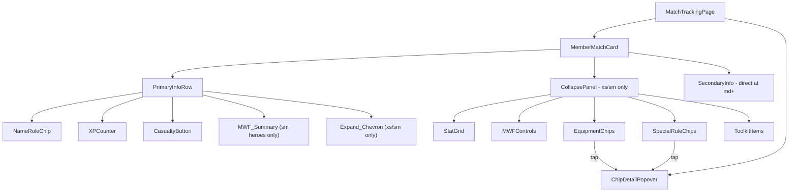

# Design Document: Match Tracking Responsive

## Overview

This feature introduces progressive disclosure to the MatchTrackingPage via responsive expand/collapse behavior on Member Cards. On xs/sm viewports, cards show only essential info (name, role, XP, casualty) by default, with secondary details (stat block, M/W/F controls, equipment chips, special rules, toolkit) hidden behind a chevron toggle. On md+ viewports, all content remains fully visible without collapse mechanics.

Additionally, equipment and special rule chips gain tap-to-view description popups (Chip_Detail_Popup), and envenom weapon entries are synthesized as wargear chips matching the existing MemberDetailsDrawer pattern.

### Key Design Decisions

1. **MUI Collapse + useMediaQuery** — Leverage MUI's built-in `Collapse` component for animation and `useMediaQuery` for breakpoint detection. No custom animation library needed; framer-motion already in project but MUI Collapse handles height transitions natively.
2. **Local component state for expand/collapse** — Each `MemberMatchCard` owns its own `expanded` boolean keyed by `memberId`. No global state needed since cards are independent.
3. **Breakpoint-driven rendering** — Use MUI's `useMediaQuery` with theme breakpoints to conditionally render collapse wrappers vs flat content. At md+, Collapse component is not rendered at all.
4. **Popover for chip descriptions** — Use MUI `Popover` anchored to chip element. Single popover instance at page level, controlled by state holding anchor element + content.
5. **Envenom weapon synthesis** — Reuse existing `envenom_weapon::<weapon_id>` pattern from MemberDetailsDrawer and CompanyDetailsPage. Filter `poisoned_attacks` from special rules display.

## Architecture



### Breakpoint Behavior Matrix

| Viewport | Collapse | Chevron | MWF Summary | MWF Controls |
|----------|----------|---------|-------------|--------------|
| xs (<600px) | Yes, collapsed default | Yes | No | Inside collapse |
| sm (600–899px) | Yes, collapsed default | Yes | Heroes only (read-only) | Inside collapse |
| md+ (≥900px) | No (not rendered) | No | No (full controls visible) | Inline |

## Components and Interfaces

### Modified: `MemberMatchCard`

Currently a flat card rendering all content. Refactored to:

```typescript
interface MemberMatchCardProps {
  mm: MemberMatchState
  delay: number
  baseStats: Record<string, number> | undefined
  statIncreases: Partial<MemberStats>
  statDecreases: Partial<MemberStats>
  specialRules: Array<string | { id: string; parameter: string | number }>
  toolkitItems: ToolkitItem[]
  permanentBrewUsed: boolean
  isAtoWanderer: boolean
  onXpChange: (delta: number) => void
  onCasualtyToggle: () => void
  onMwfChange: (stat: string, delta: number) => void
  onUseToolkitItem: (itemId: string) => void
  onRemoveToolkitItem: (itemId: string) => void
  onChipTap: (anchorEl: HTMLElement, content: ChipPopupContent) => void
}
```

Internal state:
```typescript
const [expanded, setExpanded] = useState(false)
const isMd = useMediaQuery(theme.breakpoints.up('md'))
const isSm = useMediaQuery(theme.breakpoints.between('sm', 'md'))
const isXs = useMediaQuery(theme.breakpoints.down('sm'))
```

### New: `PrimaryInfoRow`

Always-visible row containing:
- Member name + role chip
- XP counter (+/− buttons)
- Casualty button
- MWF_Summary (sm breakpoint, hero roles only)
- Expand_Chevron (xs/sm only)

```typescript
interface PrimaryInfoRowProps {
  mm: MemberMatchState
  expanded: boolean
  onToggle: () => void
  onXpChange: (delta: number) => void
  onCasualtyToggle: () => void
  showMwfSummary: boolean
  showChevron: boolean
}
```

### New: `StatGrid`

CSS Grid layout for 9 stats on xs viewport:

```typescript
interface StatGridProps {
  baseStats: Record<string, number>
  statIncreases: Partial<MemberStats>
  statDecreases: Partial<MemberStats>
  equipmentBonuses: Partial<MemberStats>
}
```

Grid CSS:
```css
display: grid;
grid-template-columns: repeat(5, 1fr);
grid-template-rows: auto auto;
```

Row 1: Mv, Fv, Sv, S, D (columns 1–5)
Row 2: A, W, C, I (columns 1–4), column 5 empty

### New: `ChipDetailPopover`

Page-level MUI Popover for chip descriptions:

```typescript
interface ChipPopupContent {
  label: string
  description: string
}

interface ChipDetailPopoverProps {
  anchorEl: HTMLElement | null
  content: ChipPopupContent | null
  onClose: () => void
}
```

### New: `MWFSummary`

Compact read-only M/W/F display for sm breakpoint:

```typescript
interface MWFSummaryProps {
  might: number | null
  will: number | null
  fate: number | null
}
```

### Utility: `getChipDescription`

Resolves description text for equipment/special rule chips:

```typescript
function getChipDescription(
  chipId: string,
  type: 'equipment' | 'wargear' | 'specialRule',
  parameter?: string
): ChipPopupContent
```

Logic:
1. For wargear chips (including `envenom_weapon::<id>`): look up equipment data by ID, return description. For envenom chips, look up `envenom_weapon` entry.
2. For equipment chips: look up equipment data, return description. If no description but has `grantsSpecialRules`, resolve those rule labels.
3. For special rule chips: look up specialRules data by ID, return description. For parameterised rules, append parameter context.
4. Fallback: label + "No description available."

## Data Models

No new persistent data models required. All state is component-local or derived from existing models.

### Component State Additions

```typescript
// In MatchTrackingPage — single popover state
interface ChipPopoverState {
  anchorEl: HTMLElement | null
  content: ChipPopupContent | null
}

// In MemberMatchCard — expand/collapse
// Simple boolean: expanded: boolean (default false)
```

### Derived Data (Envenom Weapon Synthesis)

Reuses existing pattern from MemberDetailsDrawer:

```typescript
// From member's specialRules, extract poisoned_attacks entries
// Synthesize wargear entries: `envenom_weapon::${weaponId}`
// Filter poisoned_attacks from special rules chip display
```

No changes to `ActiveMatchState`, `MemberMatchState`, or any persisted model.

## Correctness Properties

*A property is a characteristic or behavior that should hold true across all valid executions of a system — essentially, a formal statement about what the system should do. Properties serve as the bridge between human-readable specifications and machine-verifiable correctness guarantees.*

### Property 1: Expand/collapse state independence

*For any* set of member cards and any single memberId, toggling that member's expand/collapse state SHALL leave all other members' expand/collapse states unchanged.

**Validates: Requirements 5.1, 5.3**

### Property 2: Expanded state preserved during XP/casualty mutations

*For any* member card in expanded state, applying an XP increment, XP decrement, or casualty toggle SHALL result in the card remaining in expanded state.

**Validates: Requirements 5.4**

### Property 3: Aria-label reflects member name and state

*For any* member name string and any expand/collapse state (true/false), the Expand_Chevron's aria-label SHALL contain the member name and the correct action verb ("Expand" when collapsed, "Collapse" when expanded).

**Validates: Requirements 7.2**

### Property 4: Equipment chip description resolution

*For any* equipment entry, the chip description lookup SHALL return: the `description` field if present; otherwise, if `grantsSpecialRules` is non-empty, the resolved labels of those rules; otherwise, a fallback "No description available" message.

**Validates: Requirements 8.1, 8.7**

### Property 5: Special rule chip description resolution

*For any* special rule entry (plain ID or parameterised `{ id, parameter }` object), the chip description lookup SHALL return the `description` field from specialRules data matching the rule ID. For parameterised rules, the result SHALL include the parameter context.

**Validates: Requirements 8.2**

### Property 6: Envenom weapon synthesis and filtering

*For any* member whose specialRules contain `{ id: "poisoned_attacks", parameter: weapon_id }` entries, the system SHALL produce corresponding `envenom_weapon::<weapon_id>` wargear chip entries AND those `poisoned_attacks` entries SHALL be absent from the special rules chip display.

**Validates: Requirements 9.1, 9.2**

## Error Handling

| Scenario | Handling |
|----------|----------|
| Equipment/rule ID not found in data | `getChipDescription` returns label (humanised ID) + "No description available." fallback |
| Envenom weapon parameter references unknown weapon | `getWargearLabel` already humanises unknown IDs — displays "Envenom Weapon (Title Cased Id)" |
| `grantsSpecialRules` references unknown rule ID | Resolve what's available, skip unknowns, show partial list |
| Popover anchor element removed from DOM (rapid interaction) | Close popover gracefully — MUI Popover handles null anchorEl |
| Rapid toggle clicks during animation | MUI Collapse handles mid-animation reversal natively; debounce chevron clicks with 100ms guard |
| Member has null M/W/F values (warrior) | MWF_Summary not rendered; MWF controls not rendered. Conditional checks on `mightMax !== null` |
| Empty specialRules or equipment arrays | Chip sections simply don't render — no error state needed |

## Testing Strategy

### Property-Based Tests (fast-check, minimum 100 iterations each)

Library: `fast-check` (already in devDependencies)

Each property test references its design property via tag comment:

1. **Expand/collapse state independence** — Generate random arrays of memberIds (2–15 members), pick one to toggle, verify others unchanged.
   - Tag: `Feature: match-tracking-responsive, Property 1: Expand/collapse state independence`

2. **Expanded state preserved during mutations** — Generate random MemberMatchState in expanded state, apply random XP delta or casualty toggle, verify expanded remains true.
   - Tag: `Feature: match-tracking-responsive, Property 2: Expanded state preserved during XP/casualty mutations`

3. **Aria-label reflects member name and state** — Generate random strings for member names and random booleans for expanded state, verify aria-label construction.
   - Tag: `Feature: match-tracking-responsive, Property 3: Aria-label reflects member name and state`

4. **Equipment chip description resolution** — Generate random equipment entries with varying combinations of description/grantsSpecialRules/neither, verify correct priority resolution.
   - Tag: `Feature: match-tracking-responsive, Property 4: Equipment chip description resolution`

5. **Special rule chip description resolution** — Generate random special rule entries (plain string IDs and parameterised objects), verify description lookup correctness.
   - Tag: `Feature: match-tracking-responsive, Property 5: Special rule chip description resolution`

6. **Envenom weapon synthesis and filtering** — Generate random member specialRules arrays containing poisoned_attacks entries with random weapon parameters, verify synthesis produces correct wargear entries and filtering removes them from rules display.
   - Tag: `Feature: match-tracking-responsive, Property 6: Envenom weapon synthesis and filtering`

### Unit Tests (vitest + @testing-library/react)

- Breakpoint rendering: xs shows collapse, sm shows collapse + MWF summary for heroes, md shows flat content
- Chevron rotation CSS class toggles on click
- Popover opens on chip click, closes on outside click / Escape
- Popover shows correct content for equipment with description vs grantsSpecialRules vs fallback
- Keyboard activation (Enter/Space) on chevron and chips
- Envenom chip renders with correct label format
- StatGrid renders 5-col 2-row layout at xs

### Integration Tests

- Full MatchTrackingPage render with multiple members, verify independent expand/collapse
- Chip tap → popover → dismiss flow end-to-end
- Viewport resize from sm to md removes collapse wrappers

