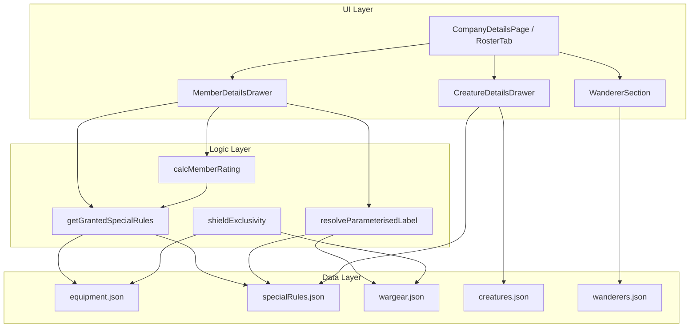

# Design Document: Member Detail Enhancements

## Overview

This feature enriches the Member Details Drawer and Company Details Page with interactive information display, correct rating calculations, equipment validation, and new roster sections for creatures and wanderers.

Key changes:
- Equipment and special rule chips become tappable, showing description popups
- Equipment-granted special rules display in the Special Rules section with source annotation, excluded from rating calculation
- Small shield / shield wargear mutual exclusivity enforcement
- Torching brand multi-rule handling
- Parameterised rule labels resolve concrete values (no "(X)" placeholders)
- Creature display nested under owning hero with dedicated detail drawer
- Wanderer section in roster tab

## Architecture



The architecture adds thin utility functions (`getGrantedSpecialRules`, `resolveParameterisedLabel`, `isShieldExclusive`) that the UI components call. The rating calculator gains an exclusion list parameter. A new `CreatureDetailsDrawer` component mirrors the existing drawer pattern.

## Components and Interfaces

### New Utility Functions

```typescript
// src/utils/grantedRules.ts

interface GrantedRule {
  ruleId: string
  parameter?: string | number
  sourceEquipmentId: string
}

/**
 * Given a member's ownedEquipment array, returns all special rules
 * granted by those equipment items (from equipment.json grantsSpecialRules).
 */
export function getGrantedSpecialRules(ownedEquipment: string[]): GrantedRule[]

/**
 * Returns the set of special rule IDs (plain or parameterised) that are
 * granted by equipment — used by the rating calculator to exclude them.
 */
export function getGrantedRuleIds(ownedEquipment: string[]): Set<string>
```

```typescript
// src/utils/paramLabel.ts

/**
 * Resolves a parameterised rule entry to its display label with concrete
 * parameter value substituted. Handles weapon → wargear label lookup,
 * friendly_hero → member name lookup, and raw value pass-through.
 */
export function resolveParameterisedLabel(
  entry: { id: string; parameter: string | number },
  companyMembers?: Array<{ id: string; name: string }>
): string
```

```typescript
// src/utils/shieldExclusivity.ts

/**
 * Returns true if adding the given item would violate shield mutual
 * exclusivity for the member.
 */
export function isShieldExclusive(
  itemToAdd: string,
  memberEquipment: string[],
  memberOwnedEquipment: string[]
): boolean
```

### Modified: `calcMemberRating`

```typescript
// Updated signature — adds optional exclusion set
export function calcMemberRating(
  member: Member,
  baseStats: StoredBaseUnitStats | undefined
): number
// Internally calls getGrantedRuleIds(member.ownedEquipment) and excludes
// those rule IDs from the special rules point tally.
```

### New Component: `CreatureDetailsDrawer`

```typescript
// src/components/common/CreatureDetailsDrawer.tsx

interface CreatureDetailsDrawerProps {
  creatureId: string | null
  open: boolean
  onClose: () => void
}
```

Displays creature stats grid, special rules (clickable with popups), and description. Reuses the same stat grid layout and rule popup pattern from `MemberDetailsDrawer`.

### Modified: `MemberDetailsDrawer`

- Equipment chips gain `onClick` → opens popup with equipment description (or granted rules list as fallback)
- Special Rules section includes granted rules with distinct border style and "(from Equipment)" annotation
- `formatSpecialRule` replaced by `resolveParameterisedLabel` for parameterised entries to eliminate "(X)"
- Granted rule chips show source equipment name on tap

### Modified: `CompanyDetailsPage` (Roster Tab)

- Hero rows render attached creature sub-row when `member.creatureId` is set
- New "Wanderers" section below Warriors when `company.wandererId` is set
- Creature sub-row shows label, points, key stats; tappable → opens `CreatureDetailsDrawer`
- Wanderer row shows full profile summary; tappable → opens detail view

## Data Models

No new persistent models required. All data comes from existing JSON files and the `Member` / `Company` interfaces.

### Derived Types (runtime only)

```typescript
// Already exists in creatures.json shape
interface CreatureData {
  id: string
  label: string
  keywords: string[]
  baseSize: number
  pointsCost: number
  influenceCost: number
  stats: {
    move: number
    fight: number
    shoot: number | null
    strength: number
    defence: number
    attacks: number
    wounds: number
    courage: number | null
    intelligence: number
  }
  specialRules: string[]
  description: string
  onTheirOwnPath: boolean
}

// Already exists in wanderers.json shape
interface WandererData {
  id: string
  label: string
  keywords: string[]
  pointsCost: number
  influenceCost: number
  stats: { /* full stat block including M/W/F */ }
  equipment: string[]
  heroicActions: string[]
  specialRules: Array<string | { id: string; parameter: string | number }>
}

// New runtime type for granted rules
interface GrantedRule {
  ruleId: string
  parameter?: string | number
  sourceEquipmentId: string
  sourceEquipmentLabel: string
}
```

### Equipment Data Shape (existing, relevant fields)

```typescript
interface EquipmentItem {
  id: string
  label: string
  description?: string
  grantsSpecialRules?: Array<string | { id: string; parameter: string | number }>
  // ... other fields
}
```

The `grantsSpecialRules` field can contain plain string IDs or parameterised objects (as seen in `torching_brand`).

## Correctness Properties

*A property is a characteristic or behavior that should hold true across all valid executions of a system — essentially, a formal statement about what the system should do. Properties serve as the bridge between human-readable specifications and machine-verifiable correctness guarantees.*

### Property 1: Equipment Popup Content Correctness

*For any* equipment item from `equipment.json` that has a non-empty `description` field, the popup content resolver SHALL return that item's `label` as the title and its `description` as the body text.

**Validates: Requirements 1.1**

### Property 2: Granted Special Rules Completeness

*For any* member whose `ownedEquipment` contains equipment items with `grantsSpecialRules` fields, the `getGrantedSpecialRules` function SHALL return exactly the union of all rules from all owned equipment's `grantsSpecialRules` arrays, with no duplicates and no omissions.

**Validates: Requirements 2.1**

### Property 3: Rating Invariant Under Granted Rules

*For any* member with equipment that grants special rules, `calcMemberRating` SHALL produce the same rating as if those granted rules were completely absent from the member's `specialRules` array — the equipment's own `rating` value is the only contribution from that equipment.

**Validates: Requirements 3.1, 3.2, 3.3, 5.3**

### Property 4: Shield Mutual Exclusivity

*For any* member, if `ownedEquipment` contains `small_shield`, then `isShieldExclusive` SHALL return `true` for every wargear item with category `shield`; and symmetrically, if `equipment` contains any wargear with category `shield`, then `isShieldExclusive` SHALL return `true` for `small_shield`.

**Validates: Requirements 4.1, 4.2**

### Property 5: Rule Description Lookup Correctness

*For any* special rule (plain string or parameterised object) that has a matching entry in `specialRules.json` with a non-empty `description` field, the description resolver SHALL return that description. For rules with no matching entry, it SHALL return `undefined`.

**Validates: Requirements 6.1, 6.2**

### Property 6: Parameter Resolution Correctness

*For any* parameterised special rule entry `{ id, parameter }` stored on a member, `resolveParameterisedLabel` SHALL produce a label that:
- Contains the concrete parameter value (resolved to weapon label for `parameter_type: weapon`, hero name for `friendly_hero`, raw value otherwise)
- Never contains the literal text "(X)"

**Validates: Requirements 7.1, 7.2, 7.3, 7.4, 7.5**

### Property 7: Wanderer Display Completeness

*For any* wanderer from `wanderers.json`, the wanderer section renderer SHALL include the wanderer's `label`, `pointsCost`, all stat values, all `equipment` items, and all `specialRules` entries in its output.

**Validates: Requirements 9.2**

## Error Handling

| Scenario | Handling |
|----------|----------|
| Equipment item ID not found in `equipment.json` | Display raw ID with fallback formatting; no popup |
| Special rule ID not found in `specialRules.json` | Display formatted ID; chip rendered non-clickable |
| Creature ID on member not found in `creatures.json` | Skip creature sub-row; log warning |
| Wanderer ID on company not found in `wanderers.json` | Skip wanderer section; log warning |
| `grantsSpecialRules` contains unknown rule ID | Display rule ID as-is; mark as granted but non-clickable |
| Parameter resolution fails (weapon ID not in wargear) | Fall back to raw parameter value display |
| Shield exclusivity check with unknown item ID | Return `false` (permissive fallback) |

## Testing Strategy

### Property-Based Tests (fast-check, minimum 100 iterations each)

PBT applies here because the core logic involves pure functions with clear input/output behavior:
- `getGrantedSpecialRules` — pure data derivation
- `calcMemberRating` — pure calculation
- `isShieldExclusive` — pure validation
- `resolveParameterisedLabel` — pure string transformation

**Library:** fast-check (already available in project via vitest ecosystem)

Each property test references its design property:
- **Feature: member-detail-enhancements, Property 1**: Equipment popup content correctness
- **Feature: member-detail-enhancements, Property 2**: Granted special rules completeness
- **Feature: member-detail-enhancements, Property 3**: Rating invariant under granted rules
- **Feature: member-detail-enhancements, Property 4**: Shield mutual exclusivity
- **Feature: member-detail-enhancements, Property 5**: Rule description lookup correctness
- **Feature: member-detail-enhancements, Property 6**: Parameter resolution correctness
- **Feature: member-detail-enhancements, Property 7**: Wanderer display completeness

### Unit Tests (example-based)

- Torching brand displays all three granted rules (Req 5.1)
- Equipment popup fallback to granted rules list when no description (Req 1.2)
- Popup dismissal on close/outside tap (Req 1.3)
- Cursor styling for clickable vs non-clickable chips (Req 1.4, 6.3, 6.4)
- Granted rules visual distinction (border style annotation) (Req 2.2)
- Shield exclusivity error message display (Req 4.3)
- Creature nested display under hero row (Req 8.1–8.6)
- Wanderer section header styling (Req 9.4)
- Store tab wanderer functionality unchanged (Req 9.5)

### Integration Tests

- Full drawer render with member owning torching_brand + small_shield + parameterised rules → verify complete output
- Roster tab render with hero + creature + wanderer → verify all sections present
