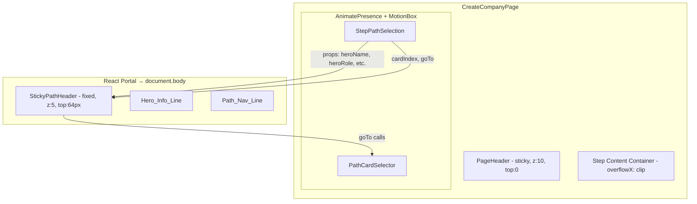
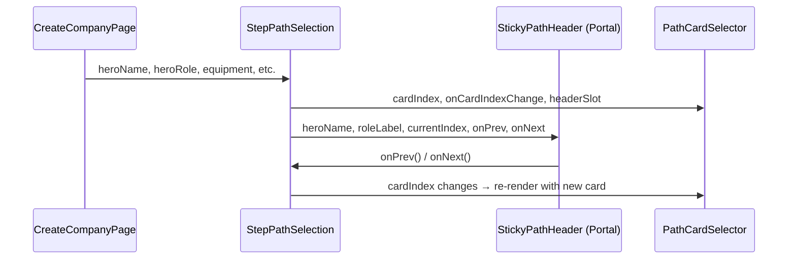

# Design Document

## Overview

This feature adds a fixed-position sticky header to the StepPathSelection wizard step on viewports below 900px. The header shows condensed hero info and path navigation controls, ensuring users never lose context while scrolling through path card content.

The core technical challenge: `position: sticky` fails inside the current DOM hierarchy because the step content container uses `overflowX: 'clip'` and AnimatePresence/motion.div wrappers create containing blocks. The solution uses a **React Portal** rendering a `position: fixed` overlay, bypassing the DOM hierarchy entirely.

### Design Decisions

| Decision | Choice | Rationale |
|----------|--------|-----------|
| Positioning strategy | `position: fixed` via Portal | `sticky` cannot escape `overflowX: clip` container. Portal renders outside the hierarchy. |
| Portal target | `document.body` | Simplest target, avoids coupling to AppLayout internals. |
| State sharing | Lift `cardIndex` to StepPathSelection, pass down to PathCardSelector | Sticky header needs read/write access to navigation state. |
| Visibility control | Conditional rendering (unmount) | Requirements mandate DOM removal when not needed, not CSS hiding. |
| Responsive detection | MUI `useMediaQuery` with `theme.breakpoints.down('md')` | Consistent with existing breakpoint usage in the project. |

## Architecture



### DOM Rendering Flow

1. `CreateCompanyPage` renders `StepPathSelection` inside the step content container (unchanged).
2. `StepPathSelection` detects viewport < 900px via `useMediaQuery`.
3. When active, `StepPathSelection` renders `StickyPathHeader` through a React Portal to `document.body`.
4. `StickyPathHeader` is positioned `fixed` at `top: 64px` (below PageHeader), `left: 0`, `right: 0`.
5. When viewport >= 900px or step changes, the portal component unmounts — removed from DOM entirely.

## Components and Interfaces

### New Component: `StickyPathHeader`

**Location:** `src/components/wizard/StickyPathHeader.tsx`

**Responsibility:** Renders the two-line fixed header via a React Portal when conditions are met.

```typescript
interface StickyPathHeaderProps {
  heroName: string
  roleLabel: string
  unitTypeLabel: string
  equipmentLabels: string[]
  currentPathName: string
  currentIndex: number
  totalPaths: number
  onPrev: () => void
  onNext: () => void
  canGoPrev: boolean
  canGoNext: boolean
}
```

**Rendering logic:**
- Uses `ReactDOM.createPortal(content, document.body)`
- Outer Box: `position: fixed`, `top: 64px`, `left: 0`, `right: 0`, `zIndex: 5`
- Line 1 (Hero_Info_Line): Single line with horizontal scroll overflow
- Line 2 (Path_Nav_Line): Flex row with arrow buttons, path name, counter

### Modified Component: `StepPathSelection`

**Changes:**
- Accepts new prop `cardIndex` and `onCardIndexChange` (lifted state from PathCardSelector)
- Conditionally renders `StickyPathHeader` via portal when `useMediaQuery(theme.breakpoints.down('md'))` is true
- Passes navigation callbacks that call into PathCardSelector's `goTo`

### Modified Component: `PathCardSelector`

**Changes:**
- Accepts optional `cardIndex` and `onCardIndexChange` props for controlled mode
- When provided, uses external state instead of internal `useState`
- Existing internal state remains as fallback for other consumers (PostMatchSummaryPage)
- Removes the existing broken `position: sticky` attempt on xs breakpoint

### State Lifting Pattern



## Data Models

No new data models required. The feature operates on existing data:

- **Hero info**: `heroName: string`, `heroRole: string`, `baseUnitId: string`, `equipment: string[]` — already passed to StepPathSelection
- **Path navigation state**: `cardIndex: number` — lifted from PathCardSelector internal state
- **Path data**: `PATHS` array from `paths.json` — already imported by PathCardSelector

### Derived Display Values

| Value | Source | Transformation |
|-------|--------|----------------|
| `roleLabel` | `heroRole` prop | `'leader' → 'Leader'`, else `'Sergeant'` |
| `unitTypeLabel` | `baseUnitId` prop | `getUnitLabel(baseUnitId)` |
| `equipmentLabels` | `equipment` prop | `equipment.map(getWargearLabel)` |
| `currentPathName` | `PATHS[cardIndex].label` | Direct lookup |
| `totalPaths` | `PATHS.length` | Constant (11 paths) |

## Correctness Properties

*A property is a characteristic or behavior that should hold true across all valid executions of a system — essentially, a formal statement about what the system should do. Properties serve as the bridge between human-readable specifications and machine-verifiable correctness guarantees.*

### Property 1: Hero info line completeness

*For any* hero with a non-empty name, a role (leader or sergeant), a valid unit type, and a list of equipment items, the rendered Hero_Info_Line output SHALL contain the hero name, the role label, the unit type label, and every equipment label.

**Validates: Requirements 2.1**

### Property 2: Path nav counter accuracy

*For any* valid card index (0 to PATHS.length - 1), the Path_Nav_Line SHALL display the path name at that index and the counter string `"(index + 1) of PATHS.length"`.

**Validates: Requirements 3.1**

### Property 3: Arrow navigation correctness

*For any* valid card index and navigation direction (left or right), if the navigation is allowed (index > 0 for left, index < max for right), then the resulting index SHALL equal the original index ± 1 in the expected direction; if the navigation is not allowed (index === 0 for left, index === max for right), the arrow button SHALL be disabled.

**Validates: Requirements 3.2, 3.3, 3.4, 3.5**

### Property 4: Conditional DOM rendering

*For any* combination of viewport width and active wizard step, the StickyPathHeader SHALL be present in the DOM if and only if the viewport width is below 900px AND the active step is StepPathSelection.

**Validates: Requirements 1.1, 1.2, 5.6, 5.7**

## Error Handling

| Scenario | Handling |
|----------|----------|
| `heroName` is empty string | Display fallback text (e.g., "Hero") — defensive, shouldn't occur in practice since wizard enforces names |
| `equipment` array is empty | Hero_Info_Line omits equipment segment entirely |
| `baseUnitId` not found in data | `getUnitLabel` returns the raw ID as fallback (existing behavior) |
| Portal target (`document.body`) unavailable | Component returns `null` — graceful no-op in SSR/test environments |
| `cardIndex` out of bounds | Clamp to valid range `[0, PATHS.length - 1]` before rendering |
| Rapid navigation clicks | No debounce needed — state updates are synchronous React setState |

## Testing Strategy

### Property-Based Tests (Vitest + fast-check)

Each correctness property maps to one property-based test with minimum 100 iterations.

| Property | Test File | What's Generated |
|----------|-----------|-----------------|
| 1: Hero info completeness | `StickyPathHeader.property.test.ts` | Random hero names, roles, unit types, equipment lists |
| 2: Path nav counter accuracy | `StickyPathHeader.property.test.ts` | Random card indices within valid range |
| 3: Arrow navigation correctness | `StickyPathHeader.property.test.ts` | Random card indices + direction (left/right) |
| 4: Conditional DOM rendering | `StickyPathHeader.property.test.ts` | Random viewport widths (300–1200) + step identifiers |

**Configuration:**
- Library: `fast-check` (already in devDependencies)
- Runner: Vitest
- Iterations: 100 per property
- Tag format: `Feature: path-selection-sticky-header, Property N: <title>`

### Unit Tests (Example-Based)

| Test | Purpose |
|------|---------|
| Sticky header renders at viewport 899px on StepPathSelection | Boundary check |
| Sticky header absent at viewport 900px | Boundary check |
| zIndex value is 5 (between 1 and 10) | Style verification |
| Left arrow disabled when cardIndex === 0 | Edge case |
| Right arrow disabled when cardIndex === PATHS.length - 1 | Edge case |
| Portal renders to document.body | DOM structure verification |

### Integration / Manual Tests

| Test | Purpose |
|------|---------|
| Scroll path card content on mobile viewport | Verify header stays fixed |
| Navigate between wizard steps | Verify header mounts/unmounts cleanly |
| Step transition animations with header present | Verify no visual glitches |
| Long hero name + many equipment items | Verify horizontal scroll/truncation |
| PageHeader remains sticky and unaffected | Regression check |
