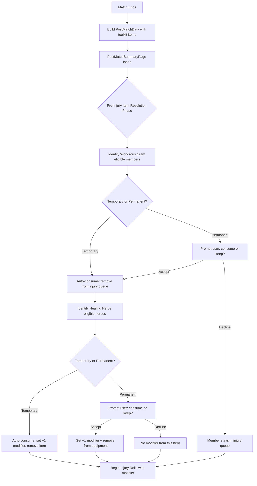

# Design Document: Post-Match Item Consumption

## Overview

Implements post-match consumption logic for Wondrous Cram and Healing Herbs equipment items. These items trigger at end-of-game based on casualty status — not during battle. System blocks battle-time "Use" interaction, resolves item effects before injury rolls, handles temporary (auto-consume) vs permanent (prompt user) distinction, and manages item removal/retention.

Key behaviors:
- **Wondrous Cram**: Casualty skips injury roll → automatic Full Recovery. Item consumed (removed).
- **Healing Herbs**: Non-casualty hero grants +1 modifier to ALL company injury rolls. Always removed on consumption. Bonus is NOT cumulative (max +1 regardless of how many herbs consumed).
- **Ordering**: Cram first (removes from injury queue), then Herbs (sets modifier for remaining casualties).
- **Temporary vs Permanent**: Toolkit items auto-consume silently. Owned items prompt user for confirmation.

## Architecture



### Integration Points

1. **MatchTrackingPage** — Block "Use" button for post-match-only items. Display as passive chips.
2. **PostMatchData** — Extended to carry toolkit items from match state into post-match flow.
3. **PostMatchSummaryPage** — New pre-injury resolution phase inserted before existing injury step.
4. **Member model** — `ownedEquipment` field used for permanent item storage/removal.

## Components and Interfaces

### New Utility Function: `isPostMatchOnlyItem(itemId: string): boolean`

Location: `src/utils/equipmentBonuses.ts` or new `src/utils/itemConsumption.ts`

```typescript
/** Items that are consumable but only at post-match, never during battle */
const POST_MATCH_ONLY_ITEMS = new Set(['wondrous_cram', 'healing_herbs'])

export function isPostMatchOnlyItem(itemId: string): boolean {
  return POST_MATCH_ONLY_ITEMS.has(itemId)
}
```

### New Utility Module: `src/utils/itemConsumption.ts`

Core logic functions (pure, testable):

```typescript
export interface ItemConsumptionCandidate {
  memberId: string
  memberName: string
  itemId: 'wondrous_cram' | 'healing_herbs'
  source: 'temporary' | 'permanent'
}

/** Identify all Wondrous Cram eligible members (casualties with item) */
export function findWondrousCramCandidates(
  casualties: PostMatchCasualty[],
  toolkitItems: ToolkitItem[],
  companyMembers: Member[]
): ItemConsumptionCandidate[]

/** Identify all Healing Herbs eligible heroes (non-casualty heroes with item) */
export function findHealingHerbsCandidates(
  casualties: PostMatchCasualty[],
  toolkitItems: ToolkitItem[],
  companyMembers: Member[],
  allMatchMembers: string[]  // all member IDs who participated
): ItemConsumptionCandidate[]

/** Remove item from member's ownedEquipment, returning updated member */
export function removeOwnedEquipment(member: Member, itemId: string): Member
```

### Modified: `PostMatchData` Interface

```typescript
export interface PostMatchData {
  // ... existing fields ...
  /** Toolkit items from match (needed for post-match consumption) */
  toolkitItems: ToolkitItem[]
}
```

### Modified: MatchTrackingPage Toolkit Rendering

In `MemberMatchCard`, toolkit item rendering logic changes:

```typescript
// Current: if (isConsumable(item.itemId)) { show Use button }
// New:     if (isConsumable(item.itemId) && !isPostMatchOnlyItem(item.itemId)) { show Use button }
//          if (isPostMatchOnlyItem(item.itemId)) { show passive chip }
```

### New UI Component: `ItemConsumptionPrompt`

Dialog component for permanent item consumption decisions:

```typescript
interface ItemConsumptionPromptProps {
  open: boolean
  memberName: string
  itemLabel: string
  itemDescription: string
  onAccept: () => void
  onDecline: () => void
}
```

## Data Models

### Changes to `PostMatchData` (src/models/postmatch.ts)

Add `toolkitItems` field:

```typescript
export interface PostMatchData {
  companyId: string
  result: 'win' | 'draw' | 'loss'
  opponentRating: number
  scenarioId: string
  scenarioLabel: string
  atoBonuses: AtoBonusType[]
  influenceBase: number
  casualties: PostMatchCasualty[]
  xpGained: PostMatchXpEntry[]
  toolkitItems: ToolkitItem[]  // NEW
}
```

### No Changes to `Member` Model

`ownedEquipment?: string[]` already exists on `Member`. Wondrous Cram and Healing Herbs stored there as `'wondrous_cram'` / `'healing_herbs'`.

### No Changes to Equipment Data

`equipment.json` already has `consumable: true` on both items. No new fields needed — `isPostMatchOnlyItem()` uses hardcoded set since only 2 items have this behavior.

### Post-Match State (internal to PostMatchSummaryPage)

```typescript
interface ItemResolutionState {
  phase: 'cram' | 'herbs' | 'done'
  cramCandidates: ItemConsumptionCandidate[]
  herbsCandidates: ItemConsumptionCandidate[]
  cramIndex: number   // current candidate being processed
  herbsIndex: number
  injuryModifier: 0 | 1  // +1 if ANY Healing Herbs consumed (not cumulative)
  resolvedCramMembers: Set<string>  // members who skip injury roll
}
```

## Correctness Properties

*A property is a characteristic or behavior that should hold true across all valid executions of a system — essentially, a formal statement about what the system should do. Properties serve as the bridge between human-readable specifications and machine-verifiable correctness guarantees.*

### Property 1: Post-match-only items render as passive chips during battle

*For any* member with Wondrous Cram or Healing Herbs in their toolkit items, `isPostMatchOnlyItem(itemId)` SHALL return true, causing chip rendering (not "Use" button) in MatchTrackingPage.

**Validates: Requirements 1.1, 1.2, 1.3, 6.1, 6.2, 6.3**

### Property 2: Wondrous Cram eligibility requires casualty status

*For any* member in post-match processing, that member is eligible for Wondrous Cram consumption if and only if they were removed as a casualty AND possess wondrous_cram (via toolkit or ownedEquipment).

**Validates: Requirements 2.1, 2.3**

### Property 3: Cram-consumed members excluded from injury queue

*For any* post-match state where Wondrous Cram is consumed for a member, that member SHALL NOT appear in the injury roll queue, and their outcome SHALL be Full Recovery.

**Validates: Requirements 2.2, 7.1**

### Property 4: Permanent Wondrous Cram removal after consumption

*For any* member with 'wondrous_cram' in ownedEquipment, after consumption, `removeOwnedEquipment(member, 'wondrous_cram')` SHALL produce a member whose ownedEquipment no longer contains 'wondrous_cram'.

**Validates: Requirements 2.4**

### Property 5: Healing Herbs eligibility requires non-casualty hero status

*For any* member in post-match processing, that member is eligible for Healing Herbs consumption if and only if they are a hero (role !== 'warrior'), were NOT removed as a casualty, AND possess healing_herbs (via toolkit or ownedEquipment).

**Validates: Requirements 3.1, 3.3**

### Property 6: Healing Herbs modifier is +1 and not cumulative

*For any* post-match state where one or more Healing Herbs are consumed, all injury rolls for all remaining casualties SHALL have exactly +1 added to their 2D6 result (capped at 12). Multiple Healing Herbs consumed in same post-match do NOT stack — modifier is always +1.

**Validates: Requirements 3.2, 7.2**

### Property 7: Healing Herbs always removed on consumption

*For any* hero with permanent Healing Herbs consumed, ownedEquipment SHALL always lose 'healing_herbs' after consumption. No retention roll or test exists.

**Validates: Requirements 3.4**

### Property 7b: Non-casualty hero eligibility for Healing Herbs

*For any* hero who was NOT removed as a casualty and possesses healing_herbs, that hero SHALL be eligible for Healing Herbs consumption regardless of other match outcomes.

**Validates: Requirements 3.1**

### Property 8: Temporary items auto-consume without prompt

*For any* toolkit-assigned (temporary) Wondrous Cram or Healing Herbs that meets eligibility criteria, consumption SHALL occur automatically without user prompt. Item discarded after use (single-use by nature).

**Validates: Requirements 4.1, 4.2, 4.3**

### Property 9: Permanent items require user confirmation

*For any* permanent (ownedEquipment) Wondrous Cram or Healing Herbs that meets eligibility criteria, system SHALL prompt user before consumption. If user declines, item remains in ownedEquipment and normal processing continues (member stays in injury queue / no modifier applied).

**Validates: Requirements 5.1, 5.2, 5.3**

### Property 10: Wondrous Cram resolved before Healing Herbs

*For any* post-match state with both Wondrous Cram and Healing Herbs eligible, all Cram resolutions (removing members from injury queue) SHALL complete before any Herbs resolutions (determining modifier).

**Validates: Requirements 7.3**

## Error Handling

| Scenario | Handling |
|----------|----------|
| Member has item but match data missing | Skip item resolution for that member, proceed normally |
| Multiple Healing Herbs consumed | Modifier still +1 (not cumulative per rules) |
| Member has both Cram and Herbs | Cram takes priority (casualty → Cram eligible, not Herbs eligible). Non-casualty hero → only Herbs eligible. Mutually exclusive by design. |
| User navigates away during prompt | State persisted; resume on return |
| Toolkit item for member not in casualties list | Item not eligible (Cram requires casualty). Herbs still eligible if hero + non-casualty. |

## Testing Strategy

### Property-Based Testing

Library: **fast-check** (already used in project)

Each property test runs minimum 100 iterations. Tests target pure logic functions in `src/utils/itemConsumption.ts`.

**Test file**: `src/utils/__tests__/itemConsumption.property.test.ts`

Properties to implement:
- Property 1: `isPostMatchOnlyItem` returns true for wondrous_cram/healing_herbs, false for all other equipment IDs
- Property 2: `findWondrousCramCandidates` returns members iff casualty + has item
- Property 3: Cram-consumed members not in resulting injury queue
- Property 4: `removeOwnedEquipment` removes exactly target item
- Property 5: `findHealingHerbsCandidates` returns members iff non-casualty hero + has item
- Property 6: Injury modifier is always +1 regardless of how many herbs consumed (not cumulative)
- Property 7: Healing Herbs always removed from ownedEquipment on consumption (no retention)
- Property 7b: Non-casualty heroes eligible for Healing Herbs
- Property 8: Temporary candidates have `source: 'temporary'` and skip prompt logic
- Property 9: Permanent candidates have `source: 'permanent'` and require prompt
- Property 10: Resolution function processes cram candidates before herbs candidates

Tag format: `Feature: post-match-item-consumption, Property {N}: {title}`

### Unit Tests (Example-Based)

- Specific scenario: member with both toolkit cram AND permanent herbs (only cram applies since casualty)
- Edge case: two heroes both consume herbs, modifier still +1 (not cumulative)
- Edge case: modifier pushes roll from 2 (dead) to 3 (arm wound)
- Integration: full PostMatchSummaryPage flow with item resolution phase

### Integration Tests

- End-to-end: match tracking → end match → post-match with items → verify company state after completion
- UI: prompt dialogs render correctly and respond to user input
