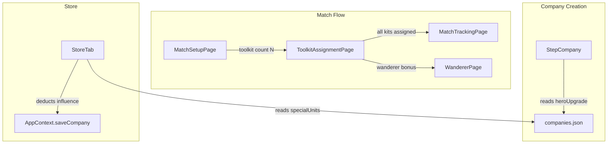

# Design Document: Toolkit Special Units & Hero Upgrades

## Overview

This design covers three independent feature additions to the Battle Companies app:

1. **Toolkit ATO Multi-Select** — Allow the Toolkit bonus to be selected up to 5 times on the Match Setup page, with a sequential kit assignment flow on the Toolkit Assignment page.
2. **Hero Upgrade Display** — Show hero upgrade information in the Company Creation Wizard's expanded details panel.
3. **Special Units in Store** — Add a "Special Units" purchase section to the Store > Reinforce tab for eligible companies.

All three features operate on existing data models (`CompanyDefinition`, `ActiveMatchState`, `WizardState`) and existing pages (`MatchSetupPage`, `ToolkitAssignmentPage`, `StepCompany`, `CompanyDetailsPage`). No new pages are introduced; changes are additive within existing components.

## Architecture



Key architectural decisions:

- **No new routes** — The multi-kit flow reuses the existing `/companies/:id/match/toolkit` route; internal state (current kit index) is managed via component state.
- **ATO bonus array encoding** — Multiple toolkit selections are stored as repeated `'toolkit'` entries in `ActiveMatchState.atoBonuses`. This preserves backward compatibility; downstream consumers derive kit count via `.filter(b => b === 'toolkit').length`.
- **Hero upgrade normalization** — `CompanyDefinition.heroUpgrade` is typed as `HeroUpgrade[]` already. The wizard normalizes any legacy single-object form to a one-element array at render time.
- **Special unit purchase** — Follows the same pattern as existing reinforcement/creature purchases: deduct influence, push a new `Member` to the roster, persist via `saveCompany`.

## Components and Interfaces

### Requirement 1 & 2: Toolkit Multi-Select + Sequential Kit Flow

**MatchSetupPage changes:**

| Concern | Current | Proposed |
|---------|---------|----------|
| Toolkit toggle | Single boolean toggle (present/absent in `atoBonuses`) | Counter-based: click increments count (up to 5), each adding 30 pts. Long-press or secondary action decrements. |
| Display | Checkmark + label | Checkmark + label + count badge (e.g. "×3") when count > 0 |
| Budget check | `companyRating + totalBonus <= opponentRating` | Same formula; toolkit contributes `30 * count` |

New helper:

```typescript
function getToolkitCount(bonuses: AtoBonusType[]): number {
  return bonuses.filter(b => b === 'toolkit').length
}
```

**ToolkitAssignmentPage changes:**

New state:

```typescript
const [currentKitIndex, setCurrentKitIndex] = useState(0)
const [accumulatedItems, setAccumulatedItems] = useState<ToolkitItem[]>([])
const [selectedKitIds, setSelectedKitIds] = useState<string[]>([])
```

Flow:
1. Derive `totalKits = getToolkitCount(match.atoBonuses)`.
2. Show progress indicator: "Kit {currentKitIndex + 1} of {totalKits}" (hidden when totalKits === 1).
3. Disable previously-selected kit types in the kit list.
4. On confirm: append items to `accumulatedItems`, push `kitId` to `selectedKitIds`, increment `currentKitIndex`.
5. When `currentKitIndex === totalKits`: save all `accumulatedItems` to `ActiveMatchState.toolkitItems` and navigate.

### Requirement 3: Hero Upgrade Display

**StepCompany changes:**

Insert a "Hero Upgrades" section between "Company Special Rules" and "Starting Roster" in the expanded details `<Collapse>` block.

```typescript
interface HeroUpgradeDisplayProps {
  heroUpgrades: HeroUpgrade[]
}
```

Rendering logic:
- Skip section if `heroUpgrade` is empty/undefined.
- Normalize single-object to array.
- For each entry: render `label`, `description`, and resolved `baseUnitIds` labels (via `getUnitLabel`).

### Requirement 4: Special Units in Store

**StoreTab changes:**

New sub-section rendered when `companyDef.specialUnits` is non-empty and `section === 'reinforcements'`.

```typescript
interface SpecialUnitRowProps {
  entry: SpecialUnitEntry
  unitLabel: string
  canPurchase: boolean
  disabledReason: string | null
  onPurchase: () => void
}
```

Purchase logic:
1. Check `company.influence >= entry.influenceCost`.
2. Check roster count < `companyDef.maxCompanySize`.
3. Check current count of members with `baseUnitId === entry.baseUnitId` < `entry.rare` (if rare defined).
4. On purchase: deduct influence, create new `Member` with role `'warrior'`, base wargear from `baseUnits.json`, append to roster.

## Data Models

No schema changes required. Existing types already support all features:

| Type | Relevant Fields | Notes |
|------|----------------|-------|
| `ActiveMatchState.atoBonuses` | `AtoBonusType[]` | Repeated `'toolkit'` entries encode multi-select |
| `CompanyDefinition.heroUpgrade` | `HeroUpgrade[]` | Already an array; normalize single-object edge case |
| `CompanyDefinition.specialUnits` | `SpecialUnitEntry[]` | `{ baseUnitId, influenceCost, rare? }` |
| `Member` | `{ id, name, baseUnitId, role, equipment, ... }` | New special unit members use role `'warrior'` |


## Correctness Properties

*A property is a characteristic or behavior that should hold true across all valid executions of a system — essentially, a formal statement about what the system should do. Properties serve as the bridge between human-readable specifications and machine-verifiable correctness guarantees.*

### Property 1: Toolkit selection validity

*For any* company rating, opponent rating, and current ATO bonus array, a toolkit selection SHALL be accepted if and only if the current toolkit count is less than 5 AND the cumulative ATO rating total plus 30 does not exceed the opponent rating.

**Validates: Requirements 1.1, 1.2, 1.3, 1.4**

### Property 2: Toolkit deselection frees budget

*For any* ATO bonus array containing at least one 'toolkit' entry, removing one 'toolkit' entry SHALL reduce the toolkit count by exactly 1 and reduce the cumulative ATO rating total by exactly 30.

**Validates: Requirements 1.5**

### Property 3: Toolkit count display

*For any* ATO bonus array, the toolkit count indicator SHALL be visible with the correct count value if and only if the number of 'toolkit' entries is greater than zero.

**Validates: Requirements 1.6, 1.7**

### Property 4: Toolkit count encoding round-trip

*For any* integer N in [0, 5], encoding N as repeated 'toolkit' entries in an atoBonuses array (possibly containing other bonus types) and then filtering for 'toolkit' entries SHALL yield exactly N entries.

**Validates: Requirements 1.8, 2.1**

### Property 5: Kit type exclusion across selections

*For any* sequence of kit selections from the available kit pool, the set of available kit types at step K SHALL equal the full kit pool minus all kit IDs selected in steps 0 through K-1.

**Validates: Requirements 2.2**

### Property 6: Kit confirmation requires full assignment and advances state

*For any* kit with N items, the confirm action SHALL be rejected (no state change) when fewer than N items are assigned, and SHALL append exactly N ToolkitItem entries to the accumulated list and increment the current kit index by 1 when all N items are assigned.

**Validates: Requirements 2.4, 2.5**

### Property 7: Progress indicator correctness

*For any* (currentKitIndex, totalKits) pair where totalKits > 1, the progress indicator text SHALL read "Kit {currentKitIndex + 1} of {totalKits}". When totalKits equals 1, no progress indicator SHALL be rendered.

**Validates: Requirements 2.7, 2.8**

### Property 8: Hero upgrade rendering completeness and order

*For any* CompanyDefinition with a non-empty heroUpgrade array, the rendered expanded details SHALL contain every entry's label and description in the same order as the source array. When the heroUpgrade array is empty or undefined, no hero upgrade section SHALL be rendered.

**Validates: Requirements 3.1, 3.2, 3.3**

### Property 9: Hero upgrade unit label resolution

*For any* HeroUpgrade entry containing a non-empty baseUnitIds array, the rendered output SHALL include the resolved label for each referenced baseUnitId.

**Validates: Requirements 3.5**

### Property 10: Hero upgrade normalization

*For any* single HeroUpgrade object, normalizing it SHALL produce a one-element array whose sole element is deeply equal to the original object.

**Validates: Requirements 3.6**

### Property 11: Special unit display completeness

*For any* SpecialUnitEntry, the rendered row SHALL contain the resolved unit label (from baseUnits data), the numeric influenceCost, and the rare value displayed as a limit count.

**Validates: Requirements 4.3**

### Property 12: Special unit purchase state transition

*For any* valid special unit purchase (sufficient influence, roster below max, count below rare limit), the resulting company state SHALL have influence reduced by exactly the unit's influenceCost and SHALL contain a new Member with the correct baseUnitId, role 'warrior', and the base unit's default wargear.

**Validates: Requirements 4.4**

### Property 13: Special unit purchase disablement

*For any* company state and special unit entry, the purchase action SHALL be disabled if and only if at least one of: (a) company influence < influenceCost, (b) roster member count >= maxCompanySize, or (c) count of roster members with matching baseUnitId >= the unit's rare value.

**Validates: Requirements 4.5, 4.6, 4.7, 4.8**

## Error Handling

| Scenario | Handling |
|----------|----------|
| Toolkit count at 5, user attempts another selection | Reject silently (button disabled / click ignored) |
| Budget insufficient for another toolkit | Disable toolkit increment; show adjusted rating indicator |
| Kit assignment page with 0 toolkit entries in atoBonuses | Should not occur (navigation guard); if reached, redirect to match setup |
| Hero upgrade field is single object instead of array | Normalize to `[obj]` before rendering; no error thrown |
| Special unit purchase with insufficient influence | Disable purchase button; no error dialog needed |
| Special unit purchase at max roster | Disable all purchase buttons; existing "Members X/X" indicator suffices |
| Special unit rare limit reached | Disable purchase button + show "Limit reached" message |
| `baseUnitId` in specialUnits not found in baseUnits.json | Log warning to console; skip rendering that entry |
| Network/IndexedDB failure during save | Existing app-level error handling (Dexie retry / toast) applies |

## Testing Strategy

**Framework:** Vitest + fast-check (already installed)

**Dual approach:**
- **Property-based tests** for all 13 correctness properties above (minimum 100 iterations each)
- **Example-based unit tests** for UI integration points (2.3, 2.6, 3.4, 4.1, 4.2) and edge cases

**Property test configuration:**
- Library: `fast-check` v4.x (already in devDependencies)
- Minimum iterations: 100 per property
- Each test tagged with: `Feature: toolkit-special-units-hero-upgrades, Property {N}: {title}`

**Test file organization:**
- `src/pages/__tests__/toolkitMultiSelect.property.test.ts` — Properties 1–4
- `src/pages/__tests__/toolkitSequentialFlow.property.test.ts` — Properties 5–7
- `src/components/wizard/__tests__/heroUpgradeDisplay.property.test.ts` — Properties 8–10
- `src/pages/__tests__/specialUnitPurchase.property.test.ts` — Properties 11–13

**Example-based tests:**
- Kit selection locking behavior (Req 2.3)
- Navigation after all kits confirmed (Req 2.6)
- "Hero Upgrades" heading presence and styling (Req 3.4)
- Special Units section conditional rendering (Req 4.1, 4.2)

**What is NOT tested via PBT:**
- Visual styling, layout positioning, animation
- IndexedDB persistence (integration test territory)
- React Router navigation side effects (mocked in unit tests)
