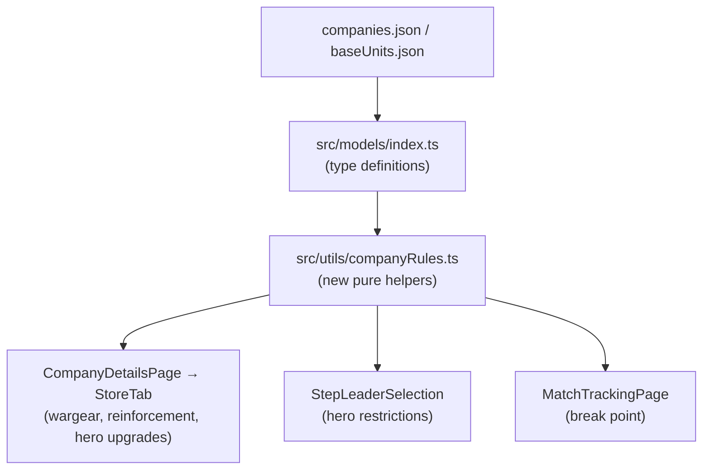

# Design Document: Unhandled Company Data Fields

## Overview

Six data fields defined in `companies.json` are fully parsed by the TypeScript models but never read by any application logic. This feature implements enforcement of all six so that company-specific rules are correctly applied during company creation, reinforcement rolling, wargear purchase, hero upgrade selection, and match break-point calculation.

The six areas are:

| # | Field / Rule | Location | Effect |
|---|---|---|---|
| 1 | `uniqueWargear` | `CompanyDefinition` | Company-specific purchasable wargear in the Store Wargear tab |
| 2 | `reinforcementSubstitution` | `CompanySpecialRule` | Optional substitution prompt after any qualifying reinforcement roll |
| 3 | `heroRestrictions` | `CompanySpecialRule` | Restricts which unit types may be assigned as heroes in the wizard |
| 4 | `count > 1` on `unit` entries | `ReinforcementEntry` | Recruits multiple units at once for a single IP deduction |
| 5 | `allowedKeywords` on `HeroUpgrade` | `HeroUpgrade` | Filters hero upgrade list by unit keywords |
| 6 | `breaking_point` special rule | `CompanySpecialRule` | Overrides the default 50 % break point with a company-specific percentage |

All six areas are additive changes — no existing behaviour is removed or altered.

---

## Architecture

The application is a React SPA with:

- **Data layer** — static JSON files in `src/data/` (read-only at runtime)
- **Model layer** — TypeScript interfaces in `src/models/index.ts`
- **Service layer** — pure helper functions in `src/services/` and `src/utils/`
- **UI layer** — React pages and components in `src/pages/` and `src/components/`

All six areas of work follow the same pattern: extend the model, add a pure helper function, and wire the helper into the relevant UI component. No new routes, no new database tables, and no new top-level components are required.



### Key Design Decisions

1. **All new logic lives in a single new utility file** (`src/utils/companyRules.ts`). This keeps `CompanyDetailsPage.tsx` from growing further and makes the helpers independently testable.
2. **No new state is introduced** for the substitution prompt — it is derived from the existing `rollResult` state and the company definition, exactly like the existing `specialPending` flag.
3. **Break point is computed on-the-fly** from the company's member count at match start; it is not persisted to the database.
4. **`uniqueWargear` items are merged into the existing wargear purchase flow** rather than rendered in a separate section, preserving UI consistency.

---

## Components and Interfaces

### 1. `src/models/index.ts` — Model Changes

#### New type: `UniqueWargearEntry`

```typescript
export interface UniqueWargearEntry {
  equipmentId: string        // ID used in member.equipment[]
  label: string              // Display name
  influenceCost: number      // IP cost
  rating: [number, number]   // [min, max] points rating
  allowedKeywords?: string[] // If present, only heroes with ≥1 matching keyword may purchase
  heroOnly?: boolean         // If true, warriors cannot purchase
  limit?: number             // Max number of company members that may carry this item simultaneously
}
```

#### Updated `CompanyDefinition`

Add the optional field:

```typescript
uniqueWargear?: UniqueWargearEntry[]
```

#### Updated `HeroUpgrade`

Add the optional field:

```typescript
allowedKeywords?: string[]
```

#### Updated `CompanySpecialRule`

Add the optional field:

```typescript
heroRestrictions?: Array<{ allowedBaseUnitIds: string[] }>
```

The existing `reinforcementSubstitution` field is already typed on `CompanySpecialRule`; no change needed there.

---

### 2. New file: `src/utils/companyRules.ts`

All new pure helper functions live here. Each function takes only plain data (no React state) and returns a plain value, making them trivially testable.

```typescript
import type { CompanyDefinition, Member, UniqueWargearEntry } from '../models'
import baseUnitsData from '../data/baseUnits.json'

// ── Keyword helpers ──────────────────────────────────────────────────────────

/**
 * Returns the keywords array for a given baseUnitId.
 * Returns [] if the unit is not found.
 */
export function getUnitKeywords(baseUnitId: string): string[]

/**
 * Returns true if the unit identified by baseUnitId has at least one keyword
 * from the allowedKeywords array.
 */
export function unitMatchesKeywords(
  baseUnitId: string,
  allowedKeywords: string[]
): boolean

// ── Unique wargear helpers ───────────────────────────────────────────────────

/**
 * Returns the uniqueWargear entries from companyDef that are eligible for
 * the given member, applying heroOnly, allowedKeywords, already-owned, and
 * limit checks.
 *
 * @param companyDef  The company definition
 * @param member      The member who wants to purchase
 * @param allMembers  All company members (used for limit check)
 */
export function getEligibleUniqueWargear(
  companyDef: CompanyDefinition,
  member: Member,
  allMembers: Member[]
): UniqueWargearEntry[]

/**
 * Returns true if the given uniqueWargear entry is at its limit across
 * the provided member list.
 */
export function isUniqueWargearAtLimit(
  entry: UniqueWargearEntry,
  allMembers: Member[]
): boolean

// ── Hero upgrade keyword filtering ───────────────────────────────────────────

/**
 * Returns the heroUpgrade entries from companyDef that are eligible for
 * the given hero member, applying allowedKeywords and already-purchased checks.
 *
 * Existing baseUnitIds filtering is preserved.
 */
export function getEligibleHeroUpgrades(
  companyDef: CompanyDefinition,
  member: Member
): import('../models').HeroUpgrade[]

// ── Hero restrictions ────────────────────────────────────────────────────────

/**
 * Returns the set of baseUnitIds that are allowed to be assigned as heroes,
 * derived from the first heroRestrictions rule found in companySpecialRules.
 * Returns null if no heroRestrictions rule exists (meaning no restriction).
 */
export function getHeroAllowedBaseUnitIds(
  companyDef: CompanyDefinition
): string[] | null

/**
 * Returns true if the given baseUnitId is eligible to be assigned as a hero
 * given the company's heroRestrictions (if any).
 */
export function isEligibleForHeroRole(
  baseUnitId: string,
  companyDef: CompanyDefinition
): boolean

// ── Reinforcement substitution ───────────────────────────────────────────────

/**
 * Returns the reinforcementSubstitution entry that applies to the given
 * final adjusted roll number, or null if none applies.
 *
 * Searches all companySpecialRules for a reinforcementSubstitution array
 * and returns the first entry whose appliesTo includes the roll.
 */
export function getApplicableSubstitution(
  companyDef: CompanyDefinition,
  finalRoll: number
): { baseUnitId: string; appliesTo: number[]; prompt: string } | null

// ── Break point ──────────────────────────────────────────────────────────────

/**
 * Calculates the break point threshold for a company.
 *
 * Algorithm:
 *   1. Look for a companySpecialRule with id === 'breaking_point'.
 *   2. If found, read parameters.breakPointPercentage (must be a number in (0,1]).
 *      If absent or invalid, log a warning and fall back to 0.5.
 *   3. Return Math.floor(startingMemberCount * percentage).
 *
 * @param companyDef        The company definition (for special rules)
 * @param startingMemberCount  The number of members at match start
 */
export function calcBreakPoint(
  companyDef: CompanyDefinition,
  startingMemberCount: number
): number

/**
 * Returns true if the company is currently broken (active non-casualty
 * member count is at or below the break point threshold).
 */
export function isCompanyBroken(
  breakPoint: number,
  activeMemberCount: number
): boolean
```

---

### 3. `src/pages/CompanyDetailsPage.tsx` — StoreTab Changes

#### 3a. Wargear section — unique wargear

In the wargear purchase section, after building `filtered` (the list of global purchasable wargear), append the eligible unique wargear entries:

```typescript
// After existing filtered list is built:
const eligibleUnique = getEligibleUniqueWargear(companyDef, selectedMember, company.members)

// Render eligibleUnique items using the same row component as global wargear,
// sourcing label and influenceCost from the UniqueWargearEntry directly.
// The purchase handler calls handleBuyWargear(memberId, entry.equipmentId, entry.influenceCost).
```

The existing `handleBuyWargear` function already handles adding `equipmentId` to `member.equipment` and deducting IP, so no changes to that function are needed.

#### 3b. Reinforcement section — substitution prompt

After `rollResult` is set (and `!specialPending`), check for an applicable substitution:

```typescript
const substitution = rollResult
  ? getApplicableSubstitution(companyDef, rollResult.roll)
  : null
```

If `substitution` is non-null, render a substitution prompt card **above** the `ReinforcementResultCard`. The prompt card contains:

- The `substitution.prompt` text
- An "Accept" button that calls `handleAcceptSubstitution(substitution.baseUnitId)`
- A "Decline" button that dismisses the prompt without changing `rollResult`

New state: `const [substitutionDeclined, setSubstitutionDeclined] = useState(false)`

`handleAcceptSubstitution(baseUnitId)` replaces `rollResult` with:
```typescript
{ type: 'unit', roll: rollResult.roll, baseUnitId, equipment: [] }
```
and sets `substitutionDeclined = false`.

The substitution prompt is hidden when:
- `substitutionDeclined === true`
- The company is at max size (show disabled state with message)
- Adding the substitute unit would violate a composition limit (show disabled state with message)

#### 3c. Reinforcement section — count > 1

In `confirmRecruitment`, when building `candidates` for a `unit` result, check `row.count`:

```typescript
// In rollOnTable, pass count through to the result:
if (row.result === 'unit') {
  return {
    type: 'unit',
    roll: rawRoll,
    baseUnitId: row.baseUnitId!,
    equipment: row.equipment ?? [],
    rare: row.rare,
    count: row.count ?? 1,   // NEW
  }
}
```

Update `ReinforcementResult` interface to include `count?: number`.

In `confirmRecruitment`, when `finalResult.type === 'unit'` and `finalResult.count > 1`, push `count` copies into `candidates`:

```typescript
const count = finalResult.count ?? 1
for (let i = 0; i < count; i++) {
  candidates.push({ baseUnitId: finalResult.baseUnitId!, equipment: finalResult.equipment ?? [] })
}
```

The existing size and composition limit checks already operate on the full `candidates` array, so they will correctly block multi-count results that would violate limits.

The `ReinforcementResultCard` should display `×N` when `result.count > 1`.

#### 3d. Hero upgrade section

The wargear section currently handles global wargear. Hero upgrades are a separate concept — they are purchased via the `MemberDetailsDrawer` (accessible from the Roster tab). The `allowedKeywords` filter must be applied wherever hero upgrades are listed.

Search for the hero upgrade rendering in `MemberDetailsDrawer` and apply `getEligibleHeroUpgrades` to filter the list before rendering.

> **Note:** If hero upgrades are currently rendered inline in `StoreTab` rather than in `MemberDetailsDrawer`, the same filter applies at that render site. The filter function is the same regardless of location.

---

### 4. `src/components/wizard/StepLeaderSelection.tsx` — Hero Restrictions

The component currently accepts `forcedLeaderId` and `forcedSergeantIds` props for pre-assigned roles. A new prop `heroAllowedBaseUnitIds` is added:

```typescript
interface Props {
  // ... existing props ...
  heroAllowedBaseUnitIds?: string[] | null  // NEW: null = no restriction
}
```

In the member rendering loop, a member is `isRestricted` when:
```typescript
const isRestricted =
  heroAllowedBaseUnitIds != null &&
  !heroAllowedBaseUnitIds.includes(member.baseUnitId)
```

A restricted member:
- Cannot be clicked to assign a hero role (same as `isDisabled`)
- Renders a `LockIcon` (same visual as forced roles, but with a different tooltip/aria-label: "Not eligible for hero role")
- Is visually dimmed (same `opacity: 0.4` as slot-full ineligibility)

The parent (`CreateCompanyPage`) derives `heroAllowedBaseUnitIds` from the selected company definition:
```typescript
const heroAllowedBaseUnitIds = useMemo(
  () => getHeroAllowedBaseUnitIds(companyDef),
  [companyDef]
)
```

---

### 5. `src/pages/MatchTrackingPage.tsx` — Break Point Display

#### 5a. Calculation

At the top of `MatchTrackingPage`, derive the break point from the match's starting member count and the company definition:

```typescript
const companyDef = COMPANIES_DEF.find((c) => c.id === company.companyTypeId)
const startingMemberCount = match.members.length  // members at match start
const breakPoint = companyDef
  ? calcBreakPoint(companyDef, startingMemberCount)
  : Math.floor(startingMemberCount / 2)

const activeMemberCount = match.members.filter((m) => !m.isCasualty).length
const isBroken = isCompanyBroken(breakPoint, activeMemberCount)
```

#### 5b. UI — Break Point Banner

Add a persistent banner below the reroll counter (or in its place when no rerolls are active). The banner shows:

```
BREAK POINT  [activeMemberCount] / [startingMemberCount]  (threshold: [breakPoint])
```

When `isBroken` is true, the banner changes colour to `error.main` and displays "BROKEN" in place of the threshold label.

The banner is always visible during a match (not just when broken), so the player can track their status proactively.

---

### 6. `src/data/companies.json` — Data Fix

The Muster of Isengard company has a `breaking_point` special rule but its `parameters` object is missing `breakPointPercentage`. Add it:

```json
{
  "id": "breaking_point",
  "title": "Breaking Point",
  "description": "Unlike other Battle Companies, the Break Point for a Muster of Isengard Battle Company is 66% rather than 50%.",
  "parameters": {
    "breakPointPercentage": 0.66
  }
}
```

---

## Data Models

### Updated `CompanyDefinition` (summary)

```typescript
export interface CompanyDefinition {
  // ... existing fields ...
  uniqueWargear?: UniqueWargearEntry[]   // NEW
}
```

### New `UniqueWargearEntry`

```typescript
export interface UniqueWargearEntry {
  equipmentId: string
  label: string
  influenceCost: number
  rating: [number, number]
  allowedKeywords?: string[]
  heroOnly?: boolean
  limit?: number
}
```

### Updated `HeroUpgrade`

```typescript
export interface HeroUpgrade {
  id: string
  label: string
  description: string
  baseUnitIds?: string[]
  allowedKeywords?: string[]   // NEW
}
```

### Updated `CompanySpecialRule`

```typescript
export interface CompanySpecialRule {
  id: string
  title: string
  flavor?: string
  description: string
  limitExemptions?: { bow?: string[]; cavalry?: string[] }
  reinforcementSubstitution?: Array<{
    baseUnitId: string
    appliesTo: number[]
    prompt: string
  }>
  heroRestrictions?: Array<{ allowedBaseUnitIds: string[] }>   // NEW
  parameters?: Record<string, unknown>
}
```

### Updated `ReinforcementResult` (local interface in `CompanyDetailsPage.tsx`)

```typescript
interface ReinforcementResult {
  type: 'none' | 'unit' | 'choice' | 'special' | 'choiceFromMultiple' | 'pair'
  roll: number
  baseUnitId?: string
  equipment?: string[]
  rare?: number
  count?: number       // NEW: from ReinforcementEntry.count
  units?: string[]
  options?: ReinforcementResult[]
  fromSpecial?: boolean
}
```

---

## Correctness Properties

*A property is a characteristic or behavior that should hold true across all valid executions of a system — essentially, a formal statement about what the system should do. Properties serve as the bridge between human-readable specifications and machine-verifiable correctness guarantees.*

### Property 1: Unique wargear keyword eligibility

*For any* hero member and any `UniqueWargearEntry` with a non-empty `allowedKeywords` array, `getEligibleUniqueWargear` should include that entry in its result if and only if the hero's `baseUnitId` resolves to a unit that has at least one keyword from `allowedKeywords`.

**Validates: Requirements 1.2, 1.3**

---

### Property 2: Unique wargear heroOnly exclusion

*For any* warrior member (role === 'warrior') and any `UniqueWargearEntry` with `heroOnly: true`, `getEligibleUniqueWargear` should never include that entry in its result.

**Validates: Requirements 1.4**

---

### Property 3: Unique wargear limit enforcement

*For any* company member list and any `UniqueWargearEntry` with a `limit` value, `getEligibleUniqueWargear` should not include that entry for any member when the count of members already carrying `entry.equipmentId` is greater than or equal to `entry.limit`.

**Validates: Requirements 1.5**

---

### Property 4: Unique wargear already-owned exclusion

*For any* hero member whose `equipment` array already contains a `UniqueWargearEntry`'s `equipmentId`, `getEligibleUniqueWargear` should not include that entry in its result.

**Validates: Requirements 1.7**

---

### Property 5: Unique wargear purchase state change

*For any* valid unique wargear purchase (member is eligible, company has sufficient IP), after the purchase the company's `influence` decreases by exactly `entry.influenceCost` and the member's `equipment` array contains `entry.equipmentId`.

**Validates: Requirements 1.6**

---

### Property 6: Substitution prompt visibility

*For any* company with a `reinforcementSubstitution` rule and any final adjusted roll number, `getApplicableSubstitution` should return a non-null result if and only if the roll number is in the rule's `appliesTo` array.

**Validates: Requirements 2.1**

---

### Property 7: Hero restrictions eligibility

*For any* company with a `heroRestrictions` rule and any member, `isEligibleForHeroRole` should return true if and only if the member's `baseUnitId` is in the `allowedBaseUnitIds` list.

**Validates: Requirements 3.1, 3.2, 3.5**

---

### Property 8: Multi-count recruitment size change

*For any* `unit` reinforcement result with `count = N` (where N ≥ 1), after a successful recruitment the company's `members` array grows by exactly N and the company's `influence` decreases by exactly `reinforcementCost` (once, regardless of N).

**Validates: Requirements 4.2, 4.6**

---

### Property 9: Multi-count size limit enforcement

*For any* company and any `unit` reinforcement result with `count = N`, if `members.length + N > maxCompanySize`, recruitment should be blocked (the company's `members` array should remain unchanged).

**Validates: Requirements 4.3**

---

### Property 10: Hero upgrade keyword filtering

*For any* hero member and any `HeroUpgrade` with a non-empty `allowedKeywords` array, `getEligibleHeroUpgrades` should include that upgrade if and only if the hero's `baseUnitId` resolves to a unit that has at least one keyword from `allowedKeywords` (and the hero has not already purchased it).

**Validates: Requirements 5.2, 5.3, 5.4, 5.5**

---

### Property 11: Break point calculation correctness

*For any* starting member count and any company definition, `calcBreakPoint` should return:
- `Math.floor(startingMemberCount * breakPointPercentage)` when a valid `breaking_point` rule with a numeric `breakPointPercentage` in `(0, 1]` is present
- `Math.floor(startingMemberCount * 0.5)` in all other cases (no rule, absent parameter, or invalid parameter)

**Validates: Requirements 6.1, 6.2, 6.3**

---

### Property 12: Broken state detection

*For any* break point threshold and any active member count, `isCompanyBroken` should return true if and only if `activeMemberCount <= breakPoint`.

**Validates: Requirements 6.5**

---

## Error Handling

### Unique wargear

- If `companyDef.uniqueWargear` is undefined or empty, `getEligibleUniqueWargear` returns `[]` — no change to existing behaviour.
- If a `UniqueWargearEntry` references an `equipmentId` not present in `wargear.json`, the item is still displayed using the entry's own `label`. The purchase flow adds the `equipmentId` to `member.equipment` as-is (consistent with how the rest of the app handles equipment IDs).

### Reinforcement substitution

- If `getApplicableSubstitution` returns null (no matching rule), the substitution prompt is simply not rendered — no change to existing flow.
- If the substitution's `baseUnitId` is not found in `baseUnits.json`, `getUnitLabel` will return the raw ID string (existing fallback behaviour).
- Size and composition limit checks are applied before the "Accept" button is enabled, with the same warning messages used elsewhere in the reinforcement flow.

### Hero restrictions

- If `heroRestrictions` is present but `allowedBaseUnitIds` is empty, `getHeroAllowedBaseUnitIds` returns `[]`, meaning no member is eligible. This is an authoring error in the data, but the UI will gracefully show all members as restricted (all locked).
- If `heroRestrictions` is absent, `getHeroAllowedBaseUnitIds` returns `null` and no filtering is applied.

### Break point

- If `parameters.breakPointPercentage` is present but not a number, or is ≤ 0 or > 1, `calcBreakPoint` logs `console.warn` and falls back to 0.5.
- If `companyDef` is undefined at match time (data integrity issue), the break point defaults to `Math.floor(startingMemberCount / 2)`.

### Count > 1

- `count` is only respected for `result === 'unit'` entries. All other result types (`choice`, `pair`, `choiceFromTable`, etc.) ignore `count` entirely.
- If `count` is 0 or negative (authoring error), it is treated as 1.

---

## Testing Strategy

### Unit tests (example-based)

Located alongside the helpers in `src/utils/__tests__/companyRules.test.ts`:

- `getEligibleUniqueWargear` with a warrior and `heroOnly: true` entry → returns `[]`
- `getEligibleUniqueWargear` with a hero who already owns the item → returns `[]`
- `getApplicableSubstitution` with a roll in `appliesTo` → returns the entry
- `getApplicableSubstitution` with a roll not in `appliesTo` → returns `null`
- `calcBreakPoint` with no `breaking_point` rule, 10 members → returns 5
- `calcBreakPoint` with `breakPointPercentage: 0.66`, 9 members → returns 5 (floor(9 * 0.66) = floor(5.94) = 5)
- `calcBreakPoint` with invalid `breakPointPercentage` → returns floor(count * 0.5)
- `isCompanyBroken(5, 5)` → true; `isCompanyBroken(5, 6)` → false

### Property-based tests (fast-check)

Located in `src/utils/__tests__/companyRules.property.test.ts`. Each test runs a minimum of 100 iterations.

**Feature: unhandled-company-data-fields, Property 1: Unique wargear keyword eligibility**
Generate: random hero baseUnitId with random keywords, random UniqueWargearEntry with random allowedKeywords. Assert: result of `getEligibleUniqueWargear` includes the entry iff at least one keyword matches.

**Feature: unhandled-company-data-fields, Property 2: Unique wargear heroOnly exclusion**
Generate: random warrior member, random UniqueWargearEntry with `heroOnly: true`. Assert: entry never appears in result.

**Feature: unhandled-company-data-fields, Property 3: Unique wargear limit enforcement**
Generate: random member list where count(equipmentId) >= limit, random UniqueWargearEntry with that limit. Assert: entry does not appear for any member.

**Feature: unhandled-company-data-fields, Property 4: Unique wargear already-owned exclusion**
Generate: random hero whose equipment already contains the equipmentId. Assert: entry does not appear.

**Feature: unhandled-company-data-fields, Property 5: Unique wargear purchase state change**
Generate: random eligible hero, random UniqueWargearEntry, random company with sufficient IP. Assert: after purchase, influence decreases by influenceCost and equipment contains equipmentId.

**Feature: unhandled-company-data-fields, Property 6: Substitution prompt visibility**
Generate: random CompanyDefinition with a reinforcementSubstitution rule, random roll number. Assert: `getApplicableSubstitution` returns non-null iff roll is in appliesTo.

**Feature: unhandled-company-data-fields, Property 7: Hero restrictions eligibility**
Generate: random CompanyDefinition with heroRestrictions, random baseUnitId. Assert: `isEligibleForHeroRole` returns true iff baseUnitId is in allowedBaseUnitIds.

**Feature: unhandled-company-data-fields, Property 8: Multi-count recruitment size change**
Generate: random company with room for N more members, random count N ≥ 1. Assert: after recruitment, members.length increases by N and influence decreases by reinforcementCost (once).

**Feature: unhandled-company-data-fields, Property 9: Multi-count size limit enforcement**
Generate: random company where members.length + N > maxCompanySize. Assert: recruitment is blocked and members.length is unchanged.

**Feature: unhandled-company-data-fields, Property 10: Hero upgrade keyword filtering**
Generate: random hero baseUnitId with random keywords, random HeroUpgrade with random allowedKeywords. Assert: upgrade appears in `getEligibleHeroUpgrades` result iff at least one keyword matches (and hero hasn't purchased it).

**Feature: unhandled-company-data-fields, Property 11: Break point calculation correctness**
Generate: random startingMemberCount (1–30), random breakPointPercentage (valid or invalid). Assert: `calcBreakPoint` returns the correct floored value or falls back to 50 % for invalid inputs.

**Feature: unhandled-company-data-fields, Property 12: Broken state detection**
Generate: random breakPoint and activeMemberCount. Assert: `isCompanyBroken` returns true iff activeMemberCount <= breakPoint.

### Integration / smoke tests

- TypeScript compilation (`tsc --noEmit`) produces zero errors after model changes — validates Requirements 7.1–7.5.
- Manual smoke test: open Muster of Isengard in the app, start a match, verify the break point banner shows 66 % threshold.
