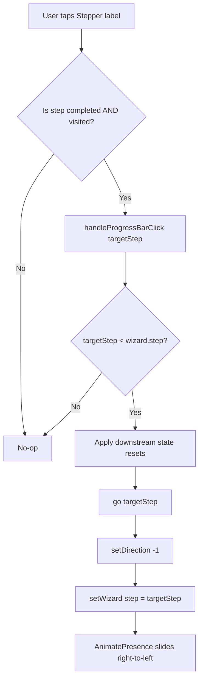
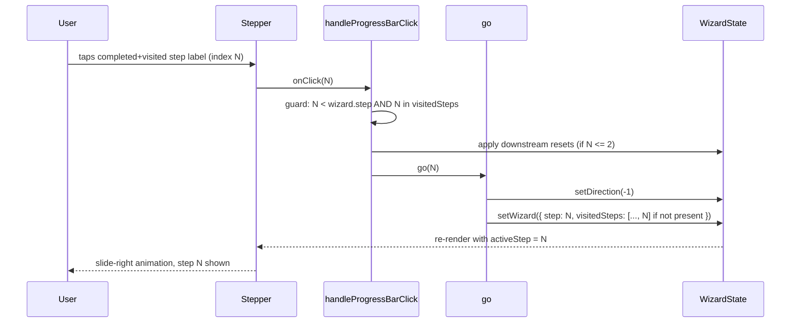
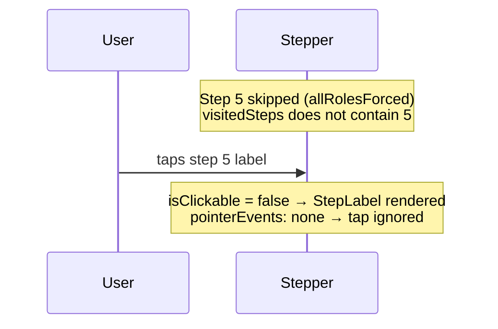

# Design Document: Wizard Progress Bar Navigation

## Overview

The company creation wizard (`CreateCompanyPage`) uses an MUI `Stepper` as a progress bar. Currently the step labels are purely decorative. This feature makes each completed, visited step label a clickable `StepButton` that navigates the user backward to that step, while keeping active and future steps non-interactive. Skipped steps (step 5 when all roles are forced; step 7 when the company has no gold) are never treated as visited and are never clickable.

## Architecture



## Components and Interfaces

### WizardState — extended with `visitedSteps`

Add a single new field to `WizardState` in `src/models/index.ts`:

```typescript
export interface WizardState {
  step: number
  visitedSteps: number[]          // NEW — ordered list of steps actually navigated to
  alignment: Alignment | null
  factionId: string | null
  companyTypeId: string | null
  variantId: string | null
  companyName: string
  memberNames: Record<string, string>
  leaderId: string | null
  sergeantIds: string[]
  heroPaths: Record<string, string>
  heroSpellChoices: Record<string, string>
  goldPurchases: Record<string, string[]>
}
```

`visitedSteps` is updated inside `go()` whenever the wizard actually navigates to a step. Skipped steps are never passed to `go()` directly — the skip logic in the Next button handler jumps over them — so they are never added to `visitedSteps`.

**Initialisation**: `INITIAL_WIZARD` gains `visitedSteps: [0]` (the user starts on step 0, which counts as visited).

**SessionStorage compatibility**: The existing draft serialisation/deserialisation (`JSON.parse`/`JSON.stringify`) handles the new field automatically. Old drafts without `visitedSteps` will deserialise with `visitedSteps: undefined`; a fallback in the state initialiser coerces this to `[0]`.

### `go()` — updated to record visited steps

```typescript
const go = (nextStep: number) => {
  setDirection(nextStep > wizard.step ? 1 : -1)
  setWizard((w) => {
    const next = { ...w, step: nextStep }

    // Record the destination as visited (deduplicated)
    if (!next.visitedSteps.includes(nextStep)) {
      next.visitedSteps = [...next.visitedSteps, nextStep]
    }

    // Existing forced-role logic when entering step 5
    if (nextStep === 5) {
      if (forcedLeaderId && next.leaderId !== forcedLeaderId) {
        next.leaderId = forcedLeaderId
      }
      if (forcedSergeantIds.length > 0) {
        next.sergeantIds = [
          ...new Set([
            ...forcedSergeantIds,
            ...next.sergeantIds.filter((id) => !forcedSergeantIds.includes(id)),
          ]),
        ]
      }
    }

    return next
  })
}
```

The skip-step paths in the Next button handler (`step 4 → step 6` when `allRolesForced`, `step 6 → finish` when no gold) call `setWizard` directly without going through `go()`, so step 5 and step 7 are never added to `visitedSteps` in those paths.

### `handleProgressBarClick()` — new handler

```typescript
const handleProgressBarClick = (targetStep: number) => {
  // Guard: only allow backward navigation to actually-visited steps
  if (targetStep >= wizard.step) return
  if (!wizard.visitedSteps.includes(targetStep)) return

  // Apply the same downstream resets as the existing step-change handlers
  setWizard((w) => {
    const next = { ...w }

    if (targetStep <= 0) {
      // Jumping to Alignment: reset everything downstream of step 0
      next.factionId = null
      next.companyTypeId = null
      next.variantId = null
      next.memberNames = {}
      next.leaderId = null
      next.sergeantIds = []
      next.heroPaths = {}
      next.heroSpellChoices = {}
    } else if (targetStep <= 1) {
      // Jumping to Faction: reset everything downstream of step 1
      next.companyTypeId = null
      next.variantId = null
      next.memberNames = {}
      next.leaderId = null
      next.sergeantIds = []
      next.heroPaths = {}
      next.heroSpellChoices = {}
    } else if (targetStep <= 2) {
      // Jumping to Company: reset everything downstream of step 2
      next.variantId = null
      next.memberNames = {}
      next.leaderId = null
      next.sergeantIds = []
      next.heroPaths = {}
      next.heroSpellChoices = {}
    }
    // Steps 3–6: no downstream resets needed (state is additive / independent)

    return next
  })

  go(targetStep)
}
```

The downstream reset logic mirrors the existing `selectAlignment`, `selectFaction`, and `selectCompany` handlers exactly, ensuring consistent behaviour regardless of how the user navigates backward.

### Stepper rendering — `StepButton` for completed+visited steps

Replace the current `Stepper` block in the JSX return with:

```tsx
<Stepper activeStep={wizard.step} alternativeLabel>
  {STEPS.map((label, index) => {
    const isCompleted =
      label === 'Command'
        ? allRolesForced && wizard.step > 5
        : index < wizard.step
    const isVisited = wizard.visitedSteps.includes(index)
    const isClickable = isCompleted && isVisited

    return (
      <Step
        key={label}
        completed={label === 'Command' ? (allRolesForced && wizard.step > 5) : undefined}
      >
        {isClickable ? (
          <StepButton
            onClick={() => handleProgressBarClick(index)}
            aria-label={`Go back to ${label} step`}
            sx={{
              cursor: 'pointer',
              '& .MuiStepLabel-label': {
                textDecoration: 'none',
                transition: 'text-decoration 0.15s',
              },
              '&:hover .MuiStepLabel-label': {
                textDecoration: 'underline',
              },
              '&:focus-visible': {
                outline: '2px solid',
                outlineColor: 'primary.main',
                outlineOffset: '2px',
                borderRadius: 1,
              },
            }}
          >
            {label}
          </StepButton>
        ) : (
          <StepLabel
            sx={{ cursor: 'default', pointerEvents: 'none' }}
            aria-disabled={index !== wizard.step ? true : undefined}
          >
            {label}
          </StepLabel>
        )}
      </Step>
    )
  })}
</Stepper>
```

`StepButton` is already part of `@mui/material` and wraps `StepLabel` with native `<button>` semantics, providing keyboard focus, Enter/Space activation, and pointer cursor out of the box. The `aria-label` attribute gives screen readers a descriptive action label. Non-interactive steps use `pointerEvents: 'none'` to prevent accidental taps on mobile and `aria-disabled` to signal non-interactivity to assistive technologies.

**Import addition**: Add `StepButton` to the existing MUI import in `CreateCompanyPage.tsx`:

```typescript
import {
  Box,
  Button,
  Typography,
  Stepper,
  Step,
  StepLabel,
  StepButton,   // NEW
  Divider,
} from '@mui/material'
```

## Data Models

### `WizardState` field: `visitedSteps`

| Property | Type | Description |
|---|---|---|
| `visitedSteps` | `number[]` | Ordered list of step indices the user has actually navigated to. Never contains skipped steps. Initialised to `[0]`. |

**Invariants**:
- `visitedSteps` always contains `0` (the wizard always starts on step 0).
- `visitedSteps` never contains a step index that was skipped (step 5 when `allRolesForced`; step 7 when `selectedCompany.gold === 0`).
- `visitedSteps` is a subset of `[0, 1, 2, 3, 4, 5, 6, 7]`.
- Entries are deduplicated — navigating back and forward to the same step does not add duplicates.

### Skip-step paths and `visitedSteps`

| Scenario | Steps added to `visitedSteps` | Steps NOT added |
|---|---|---|
| Normal flow, all steps | 0, 1, 2, 3, 4, 5, 6, 7 | — |
| `allRolesForced` (step 4 → step 6) | 0, 1, 2, 3, 4, 6 | 5 |
| No gold (step 6 → finish) | 0, 1, 2, 3, 4, 5, 6 | 7 |
| Both skips | 0, 1, 2, 3, 4, 6 | 5, 7 |

## Sequence Diagrams

### Normal backward navigation via progress bar



### Skipped step — no click affordance



## Error Handling

### Stale sessionStorage draft (missing `visitedSteps`)

Old wizard drafts persisted before this feature ships will not have `visitedSteps`. The state initialiser handles this with a fallback:

```typescript
const [wizard, setWizard] = useState<WizardState>(() => {
  try {
    const draft = sessionStorage.getItem(WIZARD_DRAFT_KEY)
    if (draft) {
      const parsed = JSON.parse(draft) as WizardState
      // Backfill visitedSteps for old drafts
      if (!parsed.visitedSteps) {
        parsed.visitedSteps = [0]
      }
      return parsed
    }
  } catch {
    /* ignore malformed draft */
  }
  return INITIAL_WIZARD
})
```

This means users with an in-progress draft will lose the visited-step history (only step 0 will be clickable) but will not experience any errors or broken state.

### Guard against invalid `targetStep`

`handleProgressBarClick` has two guards that make it a no-op for any invalid call:
1. `targetStep >= wizard.step` — prevents forward navigation.
2. `!wizard.visitedSteps.includes(targetStep)` — prevents navigation to skipped or unvisited steps.

These guards mean the function is safe to call even if the rendering logic has a bug that renders a `StepButton` for a non-clickable step.

## Testing Strategy

### Unit Testing Approach

Test `handleProgressBarClick` logic in isolation by constructing `WizardState` objects and asserting on the resulting state mutations. Key cases:

- Clicking a completed+visited step navigates to it and sets direction to -1.
- Clicking the active step is a no-op.
- Clicking a future step is a no-op.
- Clicking a step not in `visitedSteps` is a no-op.
- Clicking step 0 resets `factionId`, `companyTypeId`, and all downstream fields.
- Clicking step 1 resets `companyTypeId` and all downstream fields.
- Clicking step 2 resets `variantId`, `memberNames`, `leaderId`, `sergeantIds`, `heroPaths`, `heroSpellChoices`.
- Clicking steps 3–6 does not reset any fields.

### Property-Based Testing Approach

**Property test library**: `fast-check` (already used in the project).

**Property 1 — Backward-only navigation**
```
∀ wizard state w, ∀ targetStep t:
  handleProgressBarClick(t) causes wizard.step = t
  ONLY IF t < w.step AND t ∈ w.visitedSteps
  OTHERWISE wizard.step is unchanged
```

**Property 2 — Direction is always backward**
```
∀ valid click (t < w.step AND t ∈ w.visitedSteps):
  after handleProgressBarClick(t), direction === -1
```

**Property 3 — visitedSteps never contains skipped steps**
```
∀ wizard flow where allRolesForced = true:
  5 ∉ visitedSteps after completing the wizard

∀ wizard flow where selectedCompany.gold === 0:
  7 ∉ visitedSteps after completing the wizard
```

**Property 4 — State preservation on backward navigation**
```
∀ wizard state w at step S, ∀ targetStep t where t < S AND t ∈ w.visitedSteps:
  after handleProgressBarClick(t):
    - fields belonging to steps > t that are NOT downstream of t are unchanged
    - fields downstream of t (per the reset rules) are reset to null/empty
```

**Property 5 — Round-trip navigation**
```
∀ wizard state w at step S, ∀ targetStep t where t < S AND t ∈ w.visitedSteps:
  navigate back to t via progress bar, then advance forward to S without changes:
    wizard.step === S AND all selections made at steps t+1..S are intact
  (only valid when t > 2, since steps 0–2 trigger downstream resets)
```

**Property 6 — visitedSteps is a subset of go()-called steps**
```
∀ sequence of go(n) calls:
  visitedSteps ⊆ { n | go(n) was called }
  AND no duplicates in visitedSteps
```

### Integration Testing Approach

Render `CreateCompanyPage` in a test environment and simulate:
- Advancing through steps 0–4, then clicking step 2 in the Stepper — verify the wizard renders step 2 and the slide animation direction is backward.
- Advancing through steps 0–4 with `allRolesForced`, then skipping to step 6 — verify step 5 label does not have a `StepButton`.
- Verifying `aria-label` attributes on clickable step buttons.

## Performance Considerations

The `visitedSteps` array has at most 8 entries (one per wizard step). All operations (`includes`, spread) are O(1) in practice. No memoisation is needed.

The `handleProgressBarClick` function should be wrapped in `useCallback` with `[wizard.step, wizard.visitedSteps, forcedLeaderId, forcedSergeantIds]` as dependencies to avoid unnecessary re-renders of the Stepper.

## Security Considerations

No security implications. All navigation is client-side state mutation within a single-page wizard. No server calls are made during step navigation.

## Dependencies

- `@mui/material` — `StepButton` component (already a project dependency; only the import needs updating).
- `fast-check` — property-based test library (already used in the project).
- No new dependencies required.
