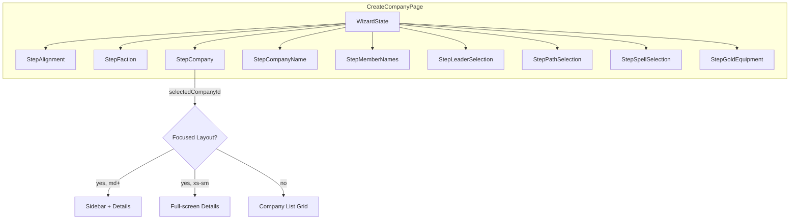

# Design Document: Wizard Responsive Design

## Overview

This design transforms the company creation wizard from a single-column mobile-first layout into a responsive multi-layout experience. Key changes:

1. **StepCompany** gains a focused layout with sidebar (md+) or full-screen detail (xs–sm) on selection
2. **StepAlignment / StepFaction** gain a conditional "Next" button for revisits
3. **StepFaction** upgrades to a 3-tier responsive grid (1→2→3 columns)
4. **StepLeaderSelection, StepSpellSelection, StepMemberNames** gain 2-column grids at sm+
5. **StepGoldEquipment** gains a split-pane layout at md+

All responsive behavior uses MUI `sx` prop with default breakpoints (`xs:0, sm:600, md:900, lg:1200`). No new dependencies required.

## Architecture



### Layout Strategy

Each step component owns its own responsive layout via MUI `sx` breakpoint objects. No shared layout wrapper needed — each step applies `display: 'grid'` or `display: 'flex'` with breakpoint-conditional `gridTemplateColumns`.

**StepCompany** is the most complex: it introduces internal layout state (`selectedCompanyId`) that drives a conditional render between list mode and focused mode. The focused mode itself is responsive (sidebar visible only at md+).

### Back Button Override

`CreateCompanyPage` already owns the Back button. The new behavior adds a guard: if `wizard.step === 2` and `wizard.companyTypeId !== null`, pressing Back clears the selection instead of navigating to step 1. This is handled in the existing `go()` / navigation logic.

## Components and Interfaces

### StepCompany (modified)

```typescript
interface StepCompanyProps {
  factionId: string
  value: string | null          // selected company ID (existing)
  onChange: (companyId: string | null) => void  // existing
}

// Internal state addition:
// selectedCompanyId: string | null — drives focused vs list layout
// (This mirrors the `value` prop; when value is non-null, focused layout activates)
```

**Layout modes:**
- `value === null` → Company_List (grid of all companies)
- `value !== null` → Focused_Layout
  - `md+`: `grid-template-columns: 220px 1fr` — sidebar left, details right
  - `xs–sm`: details only, sidebar hidden

**Collapse_Button**: Rendered inside Company_Details area (top-right or as a header action). Calls `onChange(null)`.

**Sidebar**: Compact `<List>` of unselected company names. Each item calls `onChange(companyId)` to switch focus.

### StepAlignment (modified)

```typescript
interface StepAlignmentProps {
  value: Alignment | null
  onChange: (alignment: Alignment) => void
  onAdvance?: () => void
  onNext?: () => void  // NEW — called when Next button is clicked
}
```

**Next_Button**: Rendered below alignment options when `value !== null`. Calls `onNext?.()` which maps to `go(1)` in the parent.

### StepFaction (modified)

```typescript
interface StepFactionProps {
  alignment: Alignment
  value: string | null
  onChange: (factionId: string) => void
  onAdvance?: () => void
  onNext?: () => void  // NEW — called when Next button is clicked
}
```

**Next_Button**: Rendered below faction grid when `value !== null`. Calls `onNext?.()` which maps to `go(2)` in the parent.

**Grid**: Changes from `{ xs: '1fr', sm: '1fr 1fr' }` to `{ xs: '1fr', sm: '1fr 1fr', lg: '1fr 1fr 1fr' }`.

### StepLeaderSelection (modified)

Member cards container changes from `flexDirection: 'column'` to:
```typescript
sx={{
  display: 'grid',
  gridTemplateColumns: { xs: '1fr', sm: '1fr 1fr' },
  gap: 1.5,
}}
```

### StepSpellSelection (modified)

Spell buttons container changes from `flexDirection: 'column'` to:
```typescript
sx={{
  display: 'grid',
  gridTemplateColumns: { xs: '1fr', sm: '1fr 1fr' },
  gap: 0.75,
}}
```

### StepMemberNames (modified)

Container changes to grid layout:
```typescript
sx={{
  display: 'grid',
  gridTemplateColumns: { xs: '1fr', sm: '1fr 1fr' },
  gap: 1.5,
}}
```

Group labels/dividers use `gridColumn: '1 / -1'` to span full width.

### StepGoldEquipment (modified)

At md+, switches from accordion to split-pane:
```typescript
// Outer container at md+:
sx={{
  display: { xs: 'block', md: 'grid' },
  gridTemplateColumns: { md: '35% 65%' },
  gap: 2,
}}
```

- **Left pane**: Member list (always visible, clickable to select)
- **Right pane**: Purchase panel for selected member, or placeholder prompt if none selected

At xs–sm: existing accordion behavior unchanged.

### CreateCompanyPage (modified)

Back button handler gains a guard:
```typescript
// In the back button handler:
if (wizard.step === 2 && wizard.companyTypeId !== null) {
  // Clear selection instead of navigating back
  selectCompany(null)
  return
}
```

Step 0/1 render calls gain `onNext` prop:
```typescript
<StepAlignment
  value={wizard.alignment}
  onChange={selectAlignment}
  onAdvance={() => go(1)}
  onNext={() => go(1)}    // NEW
/>
<StepFaction
  alignment={wizard.alignment!}
  value={wizard.factionId}
  onChange={selectFaction}
  onAdvance={() => go(2)}
  onNext={() => go(2)}    // NEW
/>
```

## Data Models

No new data models. All changes are UI/layout. The existing `WizardState` interface remains unchanged:

```typescript
interface WizardState {
  step: number
  visitedSteps: number[]
  alignment: Alignment | null
  factionId: string | null
  companyTypeId: string | null
  variantId: string | null
  companyName: string
  memberNames: Record<string, string>
  leaderId: string | null
  sergeantIds: string[]
  heroPaths: Record<string, string>
  heroSpellChoices: Record<string, string>
  goldPurchases: Record<string, string[]>
}
```

The `companyTypeId` field already serves as the "is focused" flag — when non-null, StepCompany renders in focused mode.

## Correctness Properties

*A property is a characteristic or behavior that should hold true across all valid executions of a system — essentially, a formal statement about what the system should do. Properties serve as the bridge between human-readable specifications and machine-verifiable correctness guarantees.*

### Property 1: Company selection transitions to focused layout

*For any* company in the available list for a given faction, selecting it SHALL set `companyTypeId` to that company's ID, causing the layout to transition to focused mode (value becomes non-null).

**Validates: Requirements 1.1**

### Property 2: Sidebar selection swaps focused company

*For any* pair of companies (A, B) available for the same faction, if A is currently selected (focused), clicking B in the sidebar SHALL set `companyTypeId` to B's ID, and A SHALL appear in the unselected list.

**Validates: Requirements 1.5**

### Property 3: Deselection actions clear company state

*For any* selected company with any variant selection, activating either the Collapse_Button or the Back_Button while in focused layout SHALL set `companyTypeId` to null and `variantId` to null, restoring the full company list.

**Validates: Requirements 2.2, 2.4**

### Property 4: Next button visibility matches non-null selection

*For any* wizard state where the user is on StepAlignment (step 0) or StepFaction (step 1), the Next_Button SHALL be rendered if and only if the corresponding selection value (alignment or factionId) is non-null.

**Validates: Requirements 3.1, 3.2, 3.3, 3.4**

### Property 5: Next button preserves downstream state

*For any* wizard state with non-null alignment (step 0) or non-null factionId (step 1) and any existing downstream state (factionId, companyTypeId, memberNames, etc.), activating the Next_Button SHALL advance the step by 1 without modifying any other wizard state fields.

**Validates: Requirements 3.5, 3.6**

### Property 6: Option click updates state and auto-advances

*For any* alignment value clicked on StepAlignment or any faction clicked on StepFaction, the corresponding state field SHALL update to the clicked value and the wizard SHALL immediately advance to the next step.

**Validates: Requirements 3.7, 3.8**

## Error Handling

| Scenario | Handling |
|----------|----------|
| No companies available for faction | Show empty-state message (existing behavior preserved) |
| Sidebar rendered with 0 unselected companies | Not possible — at least 1 company must be selected to enter focused mode, and factions always have ≥1 company |
| Back button at step 0 | Existing abort/home navigation unchanged |
| Next button clicked with null selection | Button not rendered (guard in JSX), so not reachable |
| Split-pane with no member selected | Right pane shows instructional prompt |
| Viewport resize during focused layout | CSS handles transition automatically via MUI breakpoints — no JS intervention needed |

## Testing Strategy

### Unit Tests (example-based)

Focus on responsive layout rendering at specific breakpoints:

- StepCompany: renders sidebar at md+ when company selected
- StepCompany: hides sidebar below md when company selected
- StepCompany: Collapse_Button visible in focused layout
- StepFaction: 1-column at xs, 2-column at sm, 3-column at lg
- StepLeaderSelection: 2-column grid at sm+
- StepSpellSelection: 2-column grid at sm+
- StepMemberNames: 2-column grid at sm+, group labels span full width
- StepGoldEquipment: split-pane at md+, accordion below md
- StepGoldEquipment: prompt shown when no member selected in split-pane

### Property Tests (fast-check + vitest)

Property-based tests validate state logic across all valid inputs:

- **Property 1**: Generate random factionId → filter companies → select random company → assert `companyTypeId` matches
- **Property 2**: Generate random faction with 2+ companies → select one → "click" another → assert swap
- **Property 3**: Generate random company + variant selection → trigger deselect → assert both null
- **Property 4**: Generate random wizard states with null/non-null alignment/factionId → assert Next button presence matches
- **Property 5**: Generate random wizard states with downstream data → trigger Next → assert only step changes
- **Property 6**: Generate random alignment/faction clicks → assert state update + step advance

Each property test runs minimum 100 iterations. Tests tagged with:
```
Feature: wizard-responsive-design, Property {N}: {title}
```

### Integration Tests

- Full wizard flow: select alignment → faction → company (focused) → collapse → re-select → advance
- Back button behavior: focused → clears selection; list → navigates to faction step
- Next button flow: revisit alignment with existing selection → Next → verify no downstream reset
